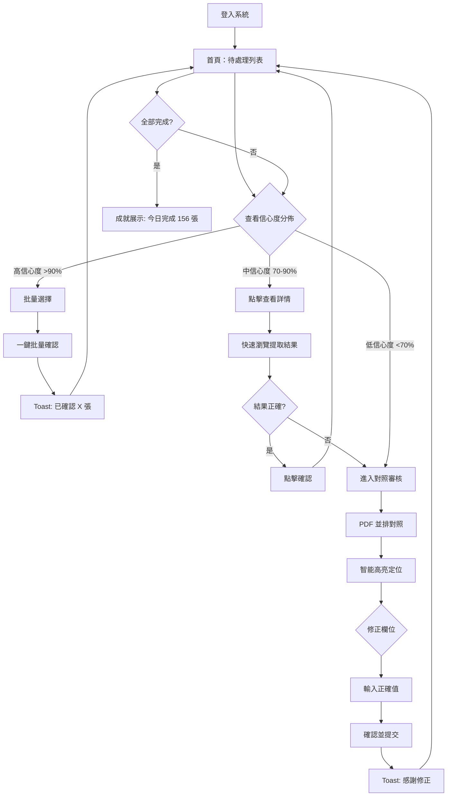
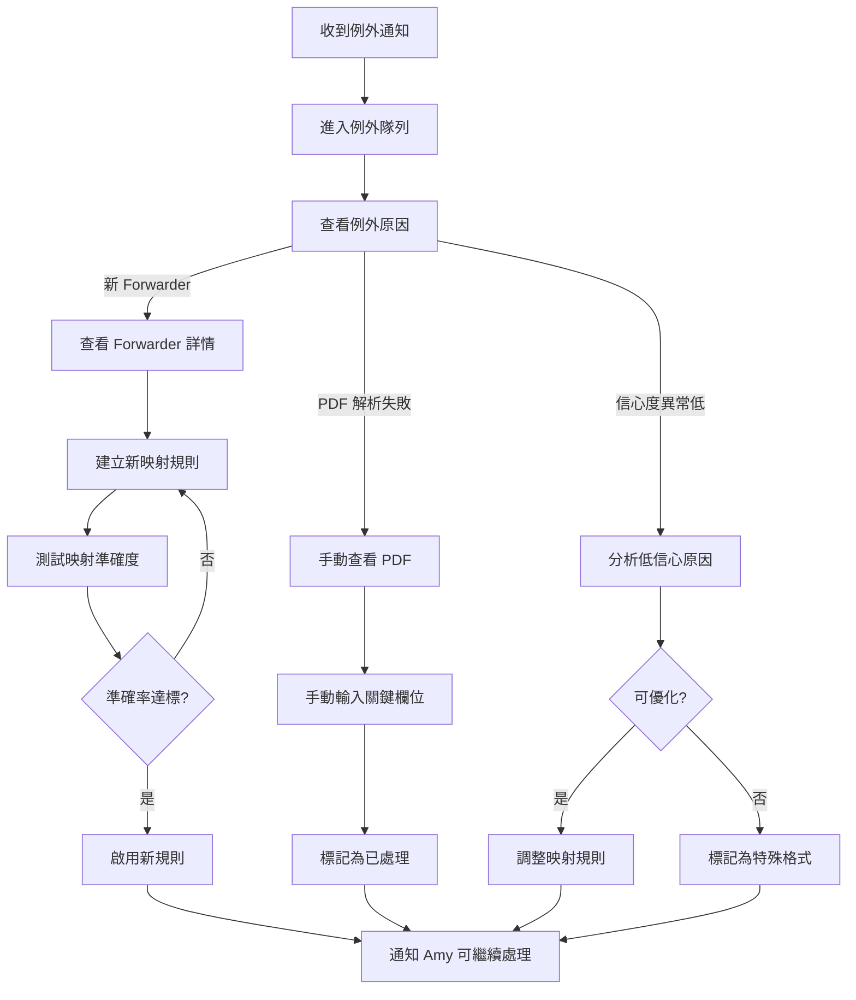
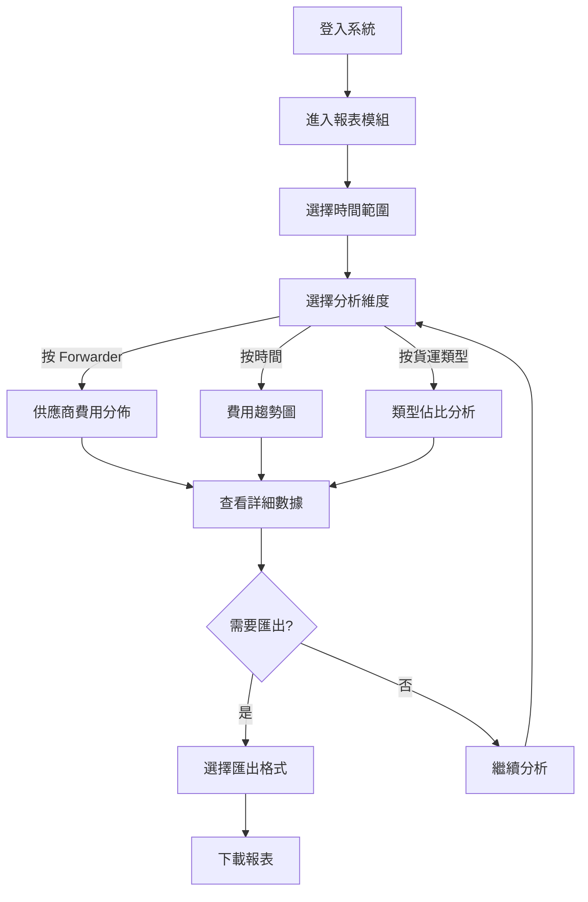
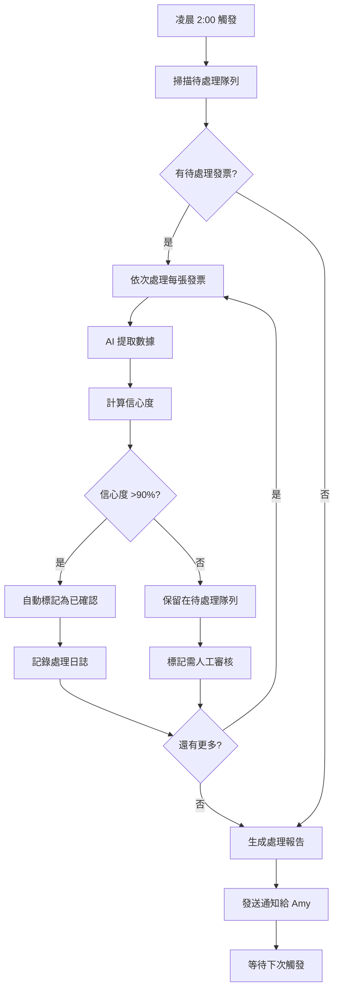

# User Journey Flows

## Journey 1: Amy 的日常發票處理

**角色：** Amy（數據處理專員）
**頻率：** 每日 150-200 張
**目標：** 高效完成發票審核和確認

**關鍵設計點：**
- 高信心度走「批量確認」快速通道
- 中信心度提供「快速瀏覽」選項
- 低信心度必須進入「對照審核」

## Journey 2: Kevin 的例外處理

**角色：** Kevin（Super User）
**頻率：** 每日處理 5-10 個例外
**目標：** 處理系統無法自動處理的特殊發票

## Journey 3: David 的費用分析

**角色：** David（SCM 經理）
**頻率：** 每週/每月
**目標：** 查看費用趨勢和供應商分析

## Journey 4: 系統自動化處理（夜間）

**角色：** 系統
**頻率：** 每日凌晨
**目標：** 自動處理高信心度發票

## Journey Patterns

**通用導航模式：**

| 模式 | 描述 | 應用場景 |
|------|------|---------|
| **首頁即工作台** | 登入後直接顯示待處理列表 | 所有角色 |
| **麵包屑導航** | 清晰的層級路徑 | 詳情頁、報表頁 |
| **快捷返回** | 左上角返回按鈕 | 所有詳情頁 |

**決策點模式：**

| 模式 | 描述 | 應用場景 |
|------|------|---------|
| **信心度分流** | 根據信心度決定處理路徑 | Amy 日常處理 |
| **批量 vs 單項** | 用戶選擇處理方式 | 高信心度發票 |
| **確認 vs 修正** | 二選一的清晰選擇 | 對照審核頁 |

**反饋模式：**

| 模式 | 描述 | 應用場景 |
|------|------|---------|
| **即時 Toast** | 操作後立即反饋 | 確認、修正、批量操作 |
| **進度更新** | 側邊欄即時統計 | 處理過程中 |
| **成就展示** | 完成時的成就卡片 | 全部完成時 |

## Flow Optimization Principles

**效率優化：**

| 原則 | 實施方式 |
|------|---------|
| **最少點擊** | 高信心度批量確認只需 2 次點擊 |
| **預載入** | 提前載入下 2 張發票 |
| **智能焦點** | 自動聚焦到需要修正的欄位 |
| **鍵盤友好** | 支援 Tab/Enter/Escape 導航 |

**認知負擔優化：**

| 原則 | 實施方式 |
|------|---------|
| **信息分層** | 高信心度不顯示詳細對照 |
| **漸進展示** | 只在需要時顯示複雜信息 |
| **清晰狀態** | 三重編碼信心度 |
| **上下文保持** | 返回列表保留篩選狀態 |

**錯誤恢復：**

| 場景 | 恢復機制 |
|------|---------|
| **誤確認** | 5 秒內可撤銷 |
| **修正錯誤** | 顯示修正歷史，可回退 |
| **系統錯誤** | 自動保存草稿，可恢復 |
| **網絡中斷** | 離線隊列，恢復後自動同步 |

---
