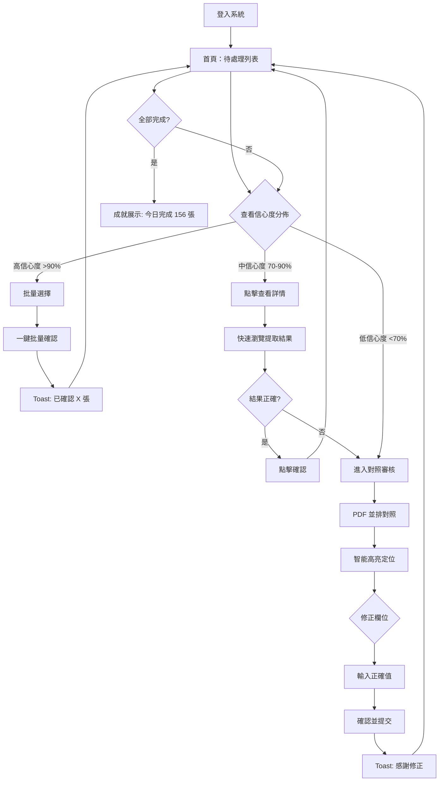
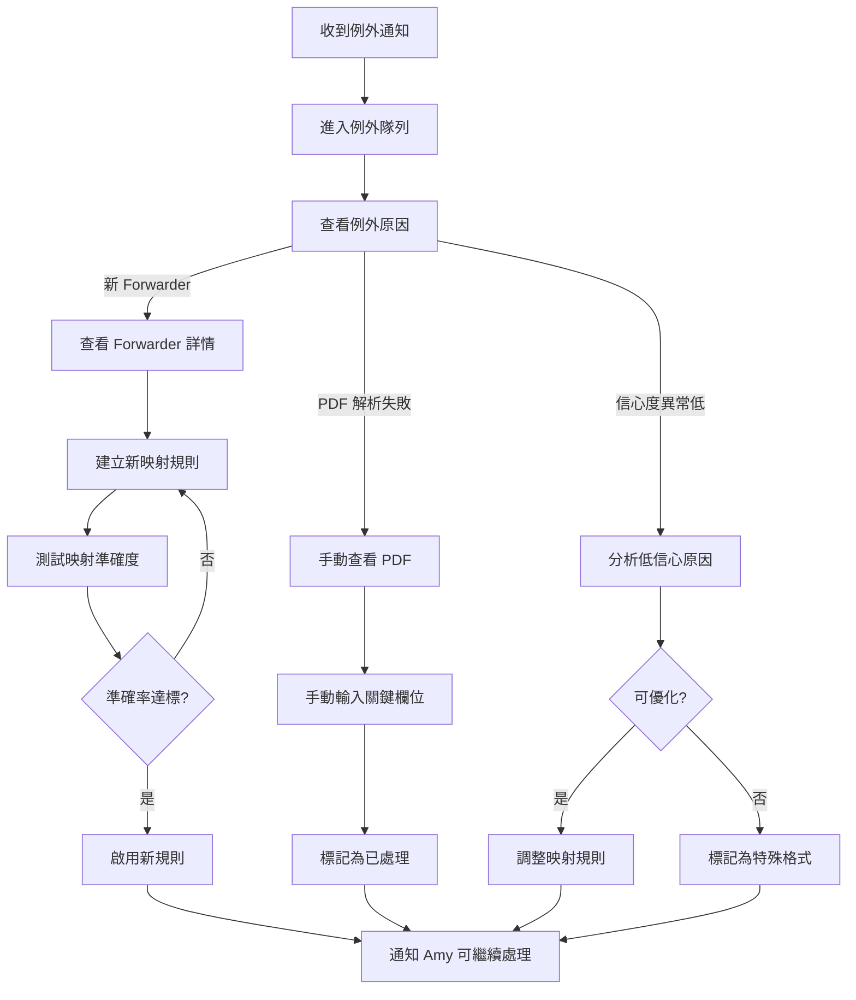
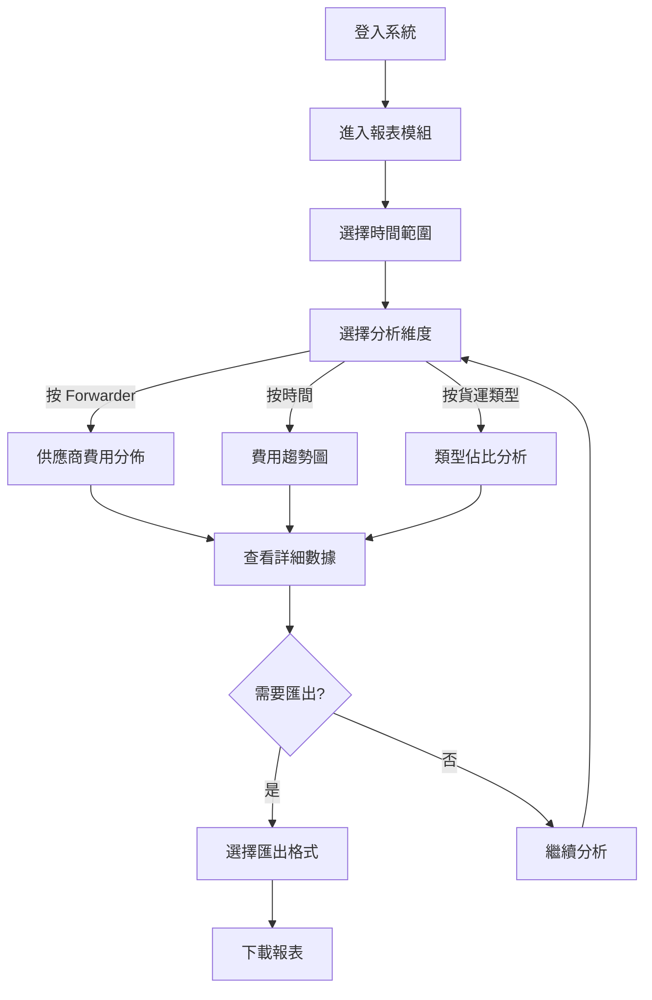
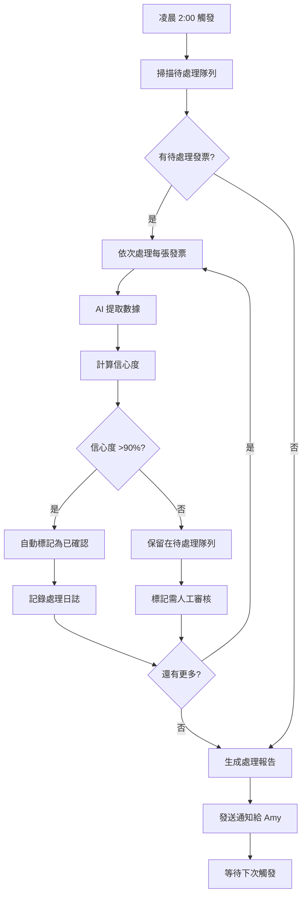

# UX Design Specification - ai-document-extraction-project

**Author:** chris
**Date:** 2025-12-14

---

<!-- UX design content will be appended sequentially through collaborative workflow steps -->

## Executive Summary

### Project Vision

ai-document-extraction-project 是一套 AI 驅動的 Freight Invoice 處理系統，專為 SCM 部門設計。系統將處理來自 45+ 個 Forwarder 的 100+ 種發票格式，每年處理量達 450,000-500,000 張。

核心價值主張是通過**三層映射架構**和**信心度評分機制**，將人工處理時間從 5 分鐘/張降至 < 1 分鐘/張，同時保持 90-95% 的準確率。

**產品定位：** 企業內部工具，先在香港試行，成功後擴展至 APAC 11 個城市。

**雙重價值定位：**
1. **自動化處理流程** - 減少人工處理時間
2. **數據獲取平台** - 提取和洞察文件內外的數據

### Target Users

本系統服務 7 個不同角色，按使用頻率和重要性排序：

**Primary Users（每日使用）：**
- **Amy（數據處理專員）** - 核心用戶，每日處理 150-200 張發票
- **Kevin（Super User）** - 例外處理和規則優化專家

**Secondary Users（每週使用）：**
- **David（SCM 經理）** - 費用分析和報表使用者
- **Eric（n8n 管理員）** - 工作流監控
- **Michelle（財務人員）** - 費用核對

**Occasional Users（每月/季度）：**
- **Tony（系統管理員）** - 系統維護和問題處理
- **James（審計人員）** - 數據追溯和審計

**UX 優先級：** 80% 精力集中在 Amy 的日常處理流程

### User Emotional Journey

**Amy 的情緒旅程：**

| 時間點 | 情緒 | 觸發點 | 設計機會 |
|-------|------|-------|---------|
| 早上開始 | 😰 焦慮 | 看到大量待處理 | 顯示「預計完成時間」而非數量 |
| 處理中 | 😐 疲勞 | 重複操作 | 里程碑慶祝、進度可視化 |
| 遇到錯誤 | 😤 挫折 | 系統出錯 | 正向措辭「幫助系統學習」 |
| 修正完成 | 😊 成就 | 解決問題 | 顯示用戶貢獻影響力 |
| 一天結束 | 😌 輕鬆 | 全部完成 | 累積成就展示 |

### Design Principles

1. **數據平台定位** - 系統不只是自動化工具，更是數據獲取和洞察平台
2. **數字優先** - 信心度、處理量、成功率等數據應清晰可見
3. **統一風格** - 所有角色使用一致的 UI 風格，通過權限控制差異化
4. **適度豐富** - 界面不過度簡化，保留有價值的數據展示
5. **透明度** - 讓用戶理解 AI 的判斷依據和處理過程

### Platform Value

| 價值層次 | 說明 |
|---------|------|
| **Level 1: 自動化** | 減少人工處理時間 |
| **Level 2: 數據提取** | 從發票中提取結構化數據 |
| **Level 3: 數據洞察** | 費用趨勢、供應商分析、異常檢測 |
| **Level 4: 決策支持** | 基於數據的業務決策 |

### Key Design Challenges

1. **信心度分流 UX** - 設計清晰的視覺層次，使用形狀+顏色+位置三重編碼（考慮色盲用戶）
2. **對照審核界面** - PDF 原文與結構化數據的高效比對，支援智能定位高亮（MVP 1.0）
3. **學習機制透明度** - 正向措辭強調「幫助系統學習」，可視化用戶貢獻影響
4. **情感設計** - 減少焦慮、對抗疲勞、建立成就感
5. **錯誤狀態處理** - 為 API 超時、PDF 解析失敗等場景設計優雅處理
6. **多角色權限設計** - 7 個角色的差異化功能訪問，統一 UI 風格
7. **跨語言跨地區** - 繁中/簡中/英文，11 個城市的本地化需求
8. **企業工具效率** - 高效、低學習成本、鍵盤友好

### Design Opportunities

1. **零點擊效率** - 高信心度發票自動完成，最大化自動化價值
2. **批量操作** - 支援多選批量確認，減少點擊次數
3. **首頁即工作台** - 登入即看到待處理列表，無需導航
4. **智能分組** - 按 Forwarder/信心度/緊急度分組，減少上下文切換
5. **夜間自動化展示** - 強調「昨晚自動處理了 X 張」的價值感知
6. **成就感設計** - 里程碑慶祝、用戶貢獻可視化
7. **身份轉變敘事** - 從「處理發票」變成「訓練 AI 夥伴」
8. **鍵盤快捷鍵** - Tab/Enter/Esc 導航，支援專業用戶高效操作

### Technical UX Considerations

| UX 功能 | MVP 階段 | 技術複雜度 |
|--------|---------|-----------|
| 顏色編碼信心度 | MVP 0.5 | 低 |
| PDF 並排顯示 | MVP 0.5 | 中 |
| 批量確認操作 | MVP 0.5 | 低 |
| 錯誤狀態處理 | MVP 0.5 | 低 |
| 鍵盤快捷鍵 | MVP 1.0 | 中 |
| 智能定位高亮 | MVP 1.0 | 高 |
| 用戶貢獻可視化 | MVP 1.0 | 中 |

---

## Core User Experience

### Defining Experience

**核心用戶動作：** 審核 AI 提取結果並確認/修正

這是系統價值的關鍵轉化點。Amy 每天執行 150-200 次這個動作，體驗必須極致順暢。

**核心體驗公式：**
```
看到提取結果 → 對照 PDF 原文 → 確認或修正 → 下一張
```

每個步驟都應該可以在 3 秒內完成。

### Platform Strategy

| 項目 | 決策 |
|------|------|
| **平台** | Web 應用（Next.js + React + shadcn/ui） |
| **主要輸入** | 滑鼠 + 鍵盤（企業桌面） |
| **瀏覽器** | Chrome/Edge 優先 |
| **螢幕優化** | 1920×1080 |
| **離線功能** | 不需要 |

### Effortless Interactions

**信心度分流體驗：**

| 信心度 | 用戶體驗 | 預期時間 |
|--------|---------|---------|
| **>90%** | 自動完成，無需操作 | 0 秒 |
| **70-90%** | 快速確認，一鍵通過 | < 3 秒 |
| **<70%** | 完整審核，對照修正 | 30-60 秒 |

**無縫互動原則：**
1. **零等待** - 預載入下一張發票，無感切換
2. **最少點擊** - 批量確認減少重複操作
3. **智能焦點** - 自動聚焦到需要修正的欄位
4. **即時反饋** - 每個動作都有視覺確認

### Critical Success Moments

| 時刻 | 期望感受 | 設計策略 |
|------|---------|---------|
| **首次登入** | 清晰、有方向 | 顯示今日待處理和預計時間 |
| **高信心度批量確認** | 高效、省力 | 「系統已自動處理 X 張」提示 |
| **對照審核** | 專注、可控 | PDF 與數據並排，智能高亮 |
| **修正提交** | 有價值、被認可 | 「感謝幫助系統學習」反饋 |
| **一天結束** | 成就、滿足 | 處理量統計、用戶貢獻展示 |

### Experience Principles

1. **數據即價值** - 每個數字都有意義，清晰展示而非隱藏
2. **無縫分流** - 用戶無需思考「這張該怎麼處理」，系統智能引導
3. **對照即核心** - PDF 原文與提取數據的對照體驗決定系統可信度
4. **效率即尊重** - 減少用戶的每一次多餘點擊，就是對時間的尊重
5. **學習即成長** - 每次修正都是系統進步的養分，讓用戶感受到貢獻價值

---

## Desired Emotional Response

### Primary Emotional Goals

**Amy（核心用戶）的首要情感目標：**

| 情感目標 | 描述 | 設計意義 |
|---------|------|---------|
| **掌控感** | 我知道今天要做什麼，系統幫我規劃好了 | 減少焦慮，建立信心 |
| **價值感** | 我不只是處理發票，我在訓練 AI 夥伴 | 身份認同轉變 |
| **成就感** | 我能清楚看到今天完成了多少 | 正向激勵循環 |
| **信任感** | 我相信系統的判斷，但保有最終控制權 | 人機協作平衡 |

**核心情感定位：** 從「被動處理文件」轉變為「主動訓練 AI」

### Emotional Journey Mapping

**Amy 一天的情感旅程設計：**

| 階段 | 當前情感 | 目標情感 | 設計策略 |
|------|---------|---------|---------|
| **早上開工** | 😰 焦慮（看到大量待處理） | 😊 從容（知道可以完成） | 顯示「預計 2 小時完成」而非「待處理 180 張」 |
| **高信心度批量** | 😐 麻木（重複確認） | 😄 輕鬆（系統幫我做了） | 強調「系統已自動處理 85 張」 |
| **低信心度審核** | 😤 煩躁（需要仔細看） | 🧐 專注（這是我的專業） | PDF 智能定位，減少搜尋時間 |
| **修正提交** | 😕 懷疑（我改對了嗎？） | 😊 肯定（系統學到了） | 「感謝您的修正，系統將記住這個模式」 |
| **下班前** | 😓 疲勞（終於做完了） | 😌 滿足（我貢獻很大） | 「今日處理 156 張，準確率提升 0.3%」 |

### Micro-Emotions

**需要強化的正向微情緒：**

| 微情緒 | 觸發場景 | 設計手法 |
|--------|---------|---------|
| **信心** | 看到高信心度標識 | 綠色 + ✓ 形狀 + 頂部位置 |
| **好奇** | 發現有趣的數據洞察 | 側邊欄展示費用趨勢 |
| **專注** | 進入審核模式 | 清晰的視覺層次，減少干擾 |
| **認可** | 完成修正後 | 即時的正向反饋訊息 |
| **歸屬** | 看到團隊處理統計 | 「您的團隊今日共處理 800 張」 |

**需要減少的負向微情緒：**

| 微情緒 | 觸發場景 | 消除策略 |
|--------|---------|---------|
| **焦慮** | 大量待處理 | 顯示預計時間而非數量 |
| **困惑** | 不知道該做什麼 | 首頁即工作台，智能分組 |
| **懷疑** | AI 判斷是否正確 | 顯示信心度來源和依據 |
| **疲勞** | 長時間重複操作 | 里程碑提示、進度可視化 |
| **挫折** | 系統出錯 | 優雅的錯誤處理，正向措辭 |

### Design Implications

**情感到設計的轉化：**

| 目標情感 | UX 設計策略 |
|---------|-----------|
| **掌控感** | 清晰的進度條、預計完成時間、可自訂排序 |
| **價值感** | 「您的修正幫助系統提升了 X%」反饋 |
| **成就感** | 里程碑慶祝（每 50 張）、日/週統計 |
| **信任感** | 顯示 AI 判斷依據、可追溯的修正歷史 |
| **專注感** | PDF 智能高亮、自動聚焦待修正欄位 |

**錯誤狀態的情感處理：**

| 錯誤類型 | 用戶情感 | 措辭策略 |
|---------|---------|---------|
| PDF 解析失敗 | 挫折 | 「這張發票格式較特殊，需要您的專業判斷」 |
| API 超時 | 焦慮 | 「系統正在努力處理，您可以先處理其他發票」 |
| 識別錯誤 | 懷疑 | 「感謝您的修正！這將幫助系統更準確」 |

### Emotional Design Principles

1. **先減負，後增值** - 首先消除焦慮和困惑，然後建立成就感
2. **數字有溫度** - 冷冰冰的數據要轉化為有意義的進度感知
3. **錯誤即機會** - 每次修正都是用戶價值的體現，而非系統的失敗
4. **透明建信任** - 讓用戶理解 AI 的判斷過程，而非黑箱操作
5. **累積見成長** - 可視化用戶的長期貢獻，建立成長敘事

---

## UX Pattern Analysis & Inspiration

### Inspiring Products Analysis

**1. Grammarly - AI 輔助寫作**

| 分析維度 | 觀察 | 可借鑒點 |
|---------|------|---------|
| **核心解決** | 即時顯示 AI 建議，用戶決定是否接受 | 人機協作模式 |
| **信心度展示** | 用顏色區分建議類型（紅=錯誤、藍=改進） | 視覺分層 |
| **互動方式** | 懸停顯示詳情，一鍵接受或忽略 | 低摩擦決策 |
| **學習機制** | 「Add to dictionary」讓系統學習 | 用戶貢獻價值 |

**2. GitHub Copilot - AI 輔助編程**

| 分析維度 | 觀察 | 可借鑒點 |
|---------|------|---------|
| **核心解決** | 預測用戶意圖，提供建議代碼 | 智能預測 |
| **信心度展示** | 灰色顯示建議，Tab 確認 | 非侵入式建議 |
| **批量處理** | 多個建議可快速切換 | 選項導航 |
| **透明度** | 顯示建議來源和依據 | 建立信任 |

**3. Notion Database - 數據管理**

| 分析維度 | 觀察 | 可借鑒點 |
|---------|------|---------|
| **核心解決** | 結構化數據的靈活展示和編輯 | 數據視圖 |
| **批量操作** | 多選 + 批量編輯 | 效率設計 |
| **篩選分組** | 多維度篩選、分組、排序 | 智能分組 |
| **鍵盤操作** | 完整的鍵盤快捷鍵支援 | 專業用戶 |

**4. Gmail - 批量郵件處理**

| 分析維度 | 觀察 | 可借鑒點 |
|---------|------|---------|
| **核心解決** | 大量信息的快速處理和分類 | 批量效率 |
| **視覺分層** | 未讀/已讀、重要/普通的視覺區分 | 狀態編碼 |
| **批量操作** | 全選、範圍選、批量歸檔 | 批量確認 |
| **快捷鍵** | e=歸檔、#=刪除、Tab 導航 | 鍵盤友好 |

**5. Adobe Acrobat - PDF 處理**

| 分析維度 | 觀察 | 可借鑒點 |
|---------|------|---------|
| **核心解決** | PDF 閱讀和標註 | PDF 展示 |
| **對照功能** | 並排比較、高亮標註 | 對照審核 |
| **縮放導航** | 靈活的縮放和頁面導航 | PDF 控制 |
| **工具列** | 常用操作一目了然 | 工具可見性 |

### Transferable UX Patterns

**導航模式：**

| 模式 | 來源 | 應用場景 |
|------|------|---------|
| **首頁即工作台** | Notion | 登入即看到待處理列表 |
| **智能分組標籤** | Gmail | 按 Forwarder/信心度分組 |
| **麵包屑導航** | Notion | 發票詳情頁的返回路徑 |

**互動模式：**

| 模式 | 來源 | 應用場景 |
|------|------|---------|
| **一鍵接受** | Grammarly | 高信心度快速確認 |
| **Tab 確認** | Copilot | 鍵盤操作確認 |
| **批量選擇** | Gmail | 多選批量確認 |
| **懸停預覽** | Grammarly | 欄位詳情預覽 |

**視覺模式：**

| 模式 | 來源 | 應用場景 |
|------|------|---------|
| **顏色+形狀編碼** | Grammarly | 信心度三重編碼 |
| **並排對照** | Acrobat | PDF 與數據對照 |
| **進度指示器** | Gmail | 處理進度可視化 |
| **狀態徽章** | Notion | 發票狀態標識 |

**反饋模式：**

| 模式 | 來源 | 應用場景 |
|------|------|---------|
| **即時反饋** | Grammarly | 修正後的確認訊息 |
| **學習確認** | Grammarly | 「已加入字典」類型反饋 |
| **成就展示** | Gmail | 「全部處理完成」慶祝 |

### Anti-Patterns to Avoid

| 反模式 | 風險 | 預防策略 |
|--------|------|---------|
| **過度自動化** | 用戶失去控制感 | 保留人工確認步驟 |
| **隱藏 AI 邏輯** | 用戶不信任結果 | 顯示信心度來源 |
| **強制線性流程** | 降低處理效率 | 允許跳過、批量操作 |
| **過度彈窗** | 打斷專注流 | 使用 toast 而非 modal |
| **複雜表單** | 增加認知負擔 | 漸進式展示、智能預填 |
| **無撤銷機制** | 誤操作焦慮 | 提供撤銷和修改歷史 |

### Design Inspiration Strategy

**採用（Adopt）：**

| 模式 | 原因 |
|------|------|
| Grammarly 的「一鍵接受」 | 完美契合高信心度快速確認場景 |
| Gmail 的批量選擇 | 符合大量發票處理需求 |
| Notion 的鍵盤快捷鍵 | 支援專業用戶高效操作 |
| Copilot 的非侵入式建議 | 不打斷用戶專注流 |

**適配（Adapt）：**

| 模式 | 調整 |
|------|------|
| Grammarly 的顏色編碼 | 增加形狀+位置編碼（色盲友好） |
| Acrobat 的並排對照 | 增加智能高亮連接（MVP 1.0） |
| Gmail 的分類標籤 | 改為信心度+Forwarder 雙維度 |

**避免（Avoid）：**

| 模式 | 原因 |
|------|------|
| 強制教程/引導 | 企業用戶偏好探索式學習 |
| 複雜的個人化設定 | 用戶需要統一風格 |
| 過度遊戲化 | 企業工具應保持專業 |
| 隱藏數據 | 數字是重要資產，需清晰展示 |

---

## Design System Foundation

### Design System Choice

**選擇：shadcn/ui + Tailwind CSS**

| 項目 | 決策 |
|------|------|
| **核心框架** | shadcn/ui（基於 Radix UI） |
| **樣式系統** | Tailwind CSS |
| **圖標庫** | Lucide Icons |
| **技術棧** | Next.js 14 + React 18 + TypeScript |

### Rationale for Selection

**為什麼選擇 shadcn/ui：**

| 考量因素 | shadcn/ui 優勢 |
|---------|---------------|
| **可定制性** | 組件代碼直接複製到項目，完全可控 |
| **無依賴鎖定** | 不是 npm 包，而是代碼模板 |
| **可訪問性** | 基於 Radix UI，內建 WCAG 2.1 AA 支援 |
| **企業適用** | 專業外觀，無花俏動畫 |
| **維護成本** | 組件獨立，更新不破壞現有代碼 |
| **團隊學習** | 文檔完善，社區活躍 |

**與項目需求的契合：**

| 項目需求 | shadcn/ui 對應能力 |
|---------|-------------------|
| 信心度視覺編碼 | Badge、Progress 組件可定制顏色 |
| PDF 並排對照 | ResizablePanel 支援分割視圖 |
| 批量操作 | Table + Checkbox 組件完善 |
| 鍵盤導航 | Radix UI 內建焦點管理 |
| Toast 反饋 | Sonner toast 組件整合 |
| 表單處理 | React Hook Form 整合良好 |

### Implementation Approach

**組件優先級（MVP 0.5）：**

| 優先級 | 組件 | 用途 |
|--------|------|------|
| P0 | Table, DataTable | 發票列表 |
| P0 | Badge | 信心度標識 |
| P0 | Button | 確認/修正操作 |
| P0 | Input, Form | 數據修正 |
| P0 | ResizablePanel | PDF 對照視圖 |
| P1 | Dialog, Sheet | 詳情面板 |
| P1 | Toast (Sonner) | 操作反饋 |
| P1 | Tabs | 視圖切換 |
| P2 | Command | 鍵盤快捷命令（MVP 1.0） |
| P2 | Progress | 處理進度 |

**檔案結構：**

```
src/
├── components/
│   ├── ui/              # shadcn/ui 組件
│   │   ├── button.tsx
│   │   ├── table.tsx
│   │   ├── badge.tsx
│   │   └── ...
│   ├── invoice/         # 業務組件
│   │   ├── InvoiceList.tsx
│   │   ├── InvoiceDetail.tsx
│   │   ├── ConfidenceBadge.tsx
│   │   └── PDFViewer.tsx
│   └── common/          # 通用組件
│       ├── PageHeader.tsx
│       └── DataTable.tsx
├── styles/
│   └── globals.css      # Tailwind + CSS 變數
└── lib/
    └── utils.ts         # cn() 工具函數
```

### Customization Strategy

**Design Tokens（CSS 變數）：**

```css
:root {
  /* 信心度顏色系統 */
  --confidence-high: 142 76% 36%;      /* 綠色 - >90% */
  --confidence-medium: 45 93% 47%;     /* 黃色 - 70-90% */
  --confidence-low: 0 84% 60%;         /* 紅色 - <70% */

  /* 品牌色 */
  --primary: 222 47% 11%;              /* 深藍 */
  --secondary: 210 40% 96%;            /* 淺灰藍 */

  /* 狀態色 */
  --success: 142 76% 36%;
  --warning: 45 93% 47%;
  --error: 0 84% 60%;
  --info: 199 89% 48%;

  /* 數據展示 */
  --data-primary: 222 47% 11%;         /* 重要數字 */
  --data-secondary: 215 16% 47%;       /* 次要數字 */
}
```

**信心度視覺系統擴展：**

| 信心度 | 顏色 | 形狀 | 位置 | 樣式類 |
|--------|------|------|------|--------|
| >90% | 綠色 | ✓ 勾號 | 頂部 | `confidence-high` |
| 70-90% | 黃色 | ○ 圓圈 | 中部 | `confidence-medium` |
| <70% | 紅色 | △ 三角 | 底部 | `confidence-low` |

**自定義組件規範：**

| 組件 | 基於 | 自定義內容 |
|------|------|-----------|
| ConfidenceBadge | Badge | 三重編碼（顏色+形狀+圖標） |
| InvoiceRow | TableRow | 信心度排序、批量選擇 |
| PDFCompareView | ResizablePanel | 智能高亮連接（MVP 1.0） |
| ActionToast | Sonner | 正向措辭反饋 |

### Design System Governance

**組件添加流程：**

1. 檢查 shadcn/ui 是否有現成組件
2. 有 → 使用 `npx shadcn-ui@latest add [component]`
3. 無 → 基於 Radix UI 構建，遵循 shadcn/ui 風格
4. 添加 Storybook 文檔
5. 更新組件索引

**風格統一原則：**

- 圓角：`rounded-md`（6px）統一使用
- 間距：基於 4px 網格（`space-1` = 4px）
- 字體：系統字體棧，中文優先 Noto Sans TC
- 陰影：僅在懸浮和彈窗使用 `shadow-md`
- 動畫：150ms ease-out，保持專業克制

---

## Defining Core Experience

### Defining Experience Statement

**ai-document-extraction-project 的定義性體驗：**

> 「一眼對照，一鍵確認」
>
> 看到 AI 提取結果，對照 PDF 原文，確認正確或修正錯誤。

**類比著名產品的定義性體驗：**

| 產品 | 定義性體驗 |
|------|-----------|
| Tinder | 「滑動配對」 |
| Instagram | 「拍照濾鏡分享」 |
| Spotify | 「即時播放任何歌曲」 |
| **本系統** | 「一眼對照，一鍵確認」 |

### User Mental Model

**Amy 的心智模型：**

| 維度 | 當前認知 | 目標認知 |
|------|---------|---------|
| **角色定位** | 「我是處理發票的人」 | 「我是訓練 AI 的專家」 |
| **工作性質** | 「重複的數據錄入」 | 「高價值的審核和決策」 |
| **系統關係** | 「系統給我任務」 | 「系統幫我完成任務」 |
| **錯誤處理** | 「AI 又錯了」 | 「AI 在向我學習」 |

**現有解決方案的痛點：**

| 痛點 | 具體表現 | 我們的改進 |
|------|---------|-----------|
| **來回切換** | Excel ↔ PDF 反覆切換視窗 | 並排對照，無需切換 |
| **找數字** | 在 PDF 中搜尋對應欄位 | 智能高亮定位 |
| **重複輸入** | 手動複製貼上每個欄位 | AI 預填，一鍵確認 |
| **進度不明** | 不知道還要處理多久 | 預計完成時間顯示 |

### Success Criteria

**核心體驗成功指標：**

| 指標 | 目標值 | 衡量方式 |
|------|--------|---------|
| **高信心度確認時間** | < 3 秒/張 | 從顯示到確認的時間 |
| **低信心度審核時間** | < 60 秒/張 | 從顯示到提交的時間 |
| **用戶信任度** | 首週即信任高信心度結果 | 用戶是否跳過對照直接確認 |
| **學習感知** | 用戶主動提及「系統變準了」 | 用戶訪談反饋 |

**用戶感知成功時刻：**

- 「看一眼就知道對不對」→ 成功的視覺設計
- 「不用來回切換視窗」→ 成功的對照體驗
- 「按一下就完成了」→ 成功的互動設計
- 「今天比昨天快」→ 成功的效率提升

### Novel vs Established Patterns

**模式分析：**

| 體驗元素 | 類型 | 說明 |
|---------|------|------|
| 信心度分流 | **創新** | 結合 AI 輸出的獨特設計 |
| PDF 並排對照 | 成熟 | 類似 Diff 工具、Adobe Acrobat |
| 批量確認 | 成熟 | 類似 Gmail 批量操作 |
| 智能高亮連接 | **創新** | PDF 與數據欄位的視覺連接 |
| 鍵盤快捷鍵 | 成熟 | 類似 Notion、VS Code |
| 用戶貢獻可視化 | **創新** | 強調用戶價值的獨特設計 |

**創新模式的教學策略：**

| 創新模式 | 教學方式 | 熟悉隱喻 |
|---------|---------|---------|
| 信心度分流 | 首次使用時的顏色圖例說明 | 交通燈（綠=通過、黃=注意、紅=停止） |
| 智能高亮連接 | 懸停時顯示連線動畫 | 類似 IDE 的「跳轉到定義」 |
| 用戶貢獻可視化 | 完成任務後的成就卡片 | 類似遊戲成就系統（但克制） |

### Experience Mechanics

**核心體驗流程分解：**

#### 1. 發起（Initiation）

| 項目 | 設計 |
|------|------|
| **觸發點** | 登入後自動顯示待處理列表 |
| **邀請方式** | 「您有 X 張發票待處理，預計 Y 分鐘完成」 |
| **起始動作** | 點擊任意發票或按 Enter 開始 |

#### 2. 互動（Interaction）

| 信心度 | 用戶動作 | 系統響應 |
|--------|---------|---------|
| >90% | 瀏覽列表，批量選擇 | 顯示勾選框，批量確認按鈕 |
| 70-90% | 快速掃視，單擊確認 | 顯示確認按鈕，成功 toast |
| <70% | 對照 PDF，修正欄位 | PDF 高亮，欄位聚焦，修正建議 |

**對照審核的詳細機制：**

```
┌─────────────────────────────────────────────────────────────┐
│  左側：PDF 原文顯示區                                        │
│  ┌─────────────────────┐  ┌─────────────────────────────┐   │
│  │                     │  │ 提取結果表單                  │   │
│  │   [PDF 文件]        │  │                              │   │
│  │                     │  │ Invoice No: INV-2024-001    │   │
│  │   ← 高亮區域 →      │←─→│ Amount: $1,234.56 [修正]    │   │
│  │                     │  │ Date: 2024-12-15           │   │
│  │                     │  │ Forwarder: DHL             │   │
│  └─────────────────────┘  └─────────────────────────────┘   │
│                                                              │
│  [上一張] [確認] [修正後確認] [跳過] [下一張]                  │
└─────────────────────────────────────────────────────────────┘
```

#### 3. 反饋（Feedback）

| 動作 | 反饋類型 | 反饋內容 |
|------|---------|---------|
| 確認成功 | Toast | ✓「已確認，處理下一張」 |
| 修正提交 | Toast + 動畫 | ✓「感謝修正，系統將學習此模式」 |
| 批量確認 | Toast + 統計 | ✓「已確認 15 張，還剩 23 張」 |
| 出錯 | 內聯提示 | ⚠️「此欄位需要填寫」 |

#### 4. 完成（Completion）

| 完成類型 | 用戶感知 | 系統反應 |
|---------|---------|---------|
| 單張完成 | 無縫切換下一張 | 自動載入，預載入 +2 張 |
| 批量完成 | 回到列表，更新統計 | 列表刷新，進度更新 |
| 全部完成 | 成就感展示 | 「太棒了！今日 156 張全部完成」 |

### Experience Flow Diagram

```
登入
  │
  ▼
┌─────────────────┐
│ 首頁：待處理列表  │◄──────────────────┐
└────────┬────────┘                    │
         │                             │
         ▼                             │
   ┌─────────────┐                     │
   │ 信心度 >90% │──Yes──► 批量確認 ────┤
   └──────┬──────┘                     │
          │No                          │
          ▼                            │
   ┌─────────────┐                     │
   │ 信心度 70-90%│──Yes──► 快速確認 ───┤
   └──────┬──────┘                     │
          │No                          │
          ▼                            │
   ┌─────────────┐                     │
   │ 對照審核界面  │                     │
   │ (PDF + 表單) │                     │
   └──────┬──────┘                     │
          │                            │
          ▼                            │
   ┌─────────────┐                     │
   │ 確認或修正   │─────────────────────┘
   └─────────────┘
```

---

## Visual Design Foundation

### Color System

**品牌色彩策略：**

由於這是企業內部工具，採用專業、可信賴的色彩方案，強調數據清晰度和狀態識別。

**主色調：**

| 色彩角色 | HSL 值 | Hex | 用途 |
|---------|--------|-----|------|
| **Primary** | 222 47% 11% | #0f172a | 主要按鈕、重要標題 |
| **Primary Light** | 217 33% 17% | #1e293b | 懸停狀態、次要強調 |
| **Secondary** | 210 40% 96% | #f1f5f9 | 背景、卡片 |
| **Accent** | 199 89% 48% | #0ea5e9 | 連結、焦點狀態 |

**信心度色彩系統（三重編碼核心）：**

| 信心度 | 顏色 | HSL | Hex | 圖標 | 視覺位置 |
|--------|------|-----|-----|------|---------|
| **高 (>90%)** | 綠色 | 142 76% 36% | #22c55e | ✓ CheckCircle | 列表頂部 |
| **中 (70-90%)** | 黃色 | 45 93% 47% | #eab308 | ○ Circle | 列表中部 |
| **低 (<70%)** | 紅色 | 0 84% 60% | #ef4444 | △ AlertTriangle | 列表底部 |

**語義色彩：**

| 角色 | HSL | Hex | 應用場景 |
|------|-----|-----|---------|
| **Success** | 142 76% 36% | #22c55e | 確認成功、完成狀態 |
| **Warning** | 45 93% 47% | #eab308 | 需要注意、待確認 |
| **Error** | 0 84% 60% | #ef4444 | 錯誤、失敗、需修正 |
| **Info** | 199 89% 48% | #0ea5e9 | 提示、說明、連結 |
| **Muted** | 215 16% 47% | #64748b | 次要文字、輔助信息 |

**對比度合規（WCAG 2.1 AA）：**

| 組合 | 對比度 | 合規等級 |
|------|--------|---------|
| Primary on White | 14.8:1 | AAA |
| Success on White | 3.2:1 | AA (Large Text) |
| Warning on White | 2.1:1 | 需搭配深色文字 |
| Error on White | 4.0:1 | AA |

### Typography System

**字體棧：**

```css
--font-sans: "Noto Sans TC", "Inter", -apple-system, BlinkMacSystemFont,
             "Segoe UI", Roboto, "Helvetica Neue", sans-serif;
--font-mono: "JetBrains Mono", "Fira Code", ui-monospace, monospace;
```

**字型層級：**

| 層級 | 大小 | 行高 | 字重 | 用途 |
|------|------|------|------|------|
| **Display** | 36px (2.25rem) | 1.2 | 700 | 頁面標題 |
| **H1** | 30px (1.875rem) | 1.3 | 600 | 區塊標題 |
| **H2** | 24px (1.5rem) | 1.35 | 600 | 卡片標題 |
| **H3** | 20px (1.25rem) | 1.4 | 600 | 小節標題 |
| **Body Large** | 18px (1.125rem) | 1.6 | 400 | 重要說明 |
| **Body** | 16px (1rem) | 1.5 | 400 | 正文內容 |
| **Body Small** | 14px (0.875rem) | 1.5 | 400 | 輔助文字 |
| **Caption** | 12px (0.75rem) | 1.4 | 400 | 標籤、時間戳 |

**數據展示字型：**

| 類型 | 大小 | 字重 | 用途 |
|------|------|------|------|
| **數字大** | 32px | 700 | 統計數據（處理量） |
| **數字中** | 24px | 600 | 信心度百分比 |
| **數字小** | 16px | 500 | 表格數據、金額 |
| **數字等寬** | 14px (mono) | 400 | 發票號碼、日期 |

### Spacing & Layout Foundation

**間距系統（4px 基準）：**

| Token | 值 | 用途 |
|-------|-----|------|
| `space-0` | 0px | 無間距 |
| `space-1` | 4px | 圖標與文字 |
| `space-2` | 8px | 緊湊元素間距 |
| `space-3` | 12px | 表單元素內間距 |
| `space-4` | 16px | 標準元素間距 |
| `space-5` | 20px | 區塊內間距 |
| `space-6` | 24px | 卡片內間距 |
| `space-8` | 32px | 區塊間間距 |
| `space-10` | 40px | 大區塊分隔 |
| `space-12` | 48px | 頁面區域分隔 |

**佈局網格：**

| 項目 | 規格 |
|------|------|
| **容器最大寬度** | 1440px |
| **側邊欄寬度** | 280px（可收合至 64px） |
| **內容區域** | 自適應（min: 800px） |
| **表格列間距** | 16px |
| **卡片間距** | 24px |

**響應式斷點：**

| 斷點 | 寬度 | 佈局調整 |
|------|------|---------|
| `sm` | 640px | 移動端（不優先支援） |
| `md` | 768px | 平板端（不優先支援） |
| `lg` | 1024px | 小螢幕桌面 |
| `xl` | 1280px | 標準桌面 |
| `2xl` | 1536px | 大螢幕桌面（主要設計） |

**PDF 對照佈局：**

```
┌──────────────────────────────────────────────────────────┐
│ Header (64px)                                            │
├────────────┬─────────────────────────────────────────────┤
│            │                                             │
│  Sidebar   │  Main Content Area                          │
│  (280px)   │  ┌────────────────┬────────────────────┐    │
│            │  │ PDF Viewer     │ Data Form          │    │
│  - 導航     │  │ (50% - 60%)   │ (40% - 50%)       │    │
│  - 篩選     │  │               │                    │    │
│  - 統計     │  │               │                    │    │
│            │  └────────────────┴────────────────────┘    │
│            │                                             │
└────────────┴─────────────────────────────────────────────┘
```

### Accessibility Considerations

**視覺無障礙設計：**

| 項目 | 標準 | 實施方式 |
|------|------|---------|
| **色彩對比** | WCAG 2.1 AA | 文字對比度 ≥ 4.5:1 |
| **色盲友好** | 三重編碼 | 顏色 + 形狀 + 位置 |
| **焦點指示** | 可見焦點環 | 2px solid + offset |
| **字體大小** | 最小 14px | 可縮放至 200% |
| **行高** | ≥ 1.5 | 正文內容保持可讀性 |

**信心度的無障礙設計：**

| 信心度 | 顏色 | 形狀 | 圖標 | 文字標籤 |
|--------|------|------|------|---------|
| 高 | 綠色 | 圓角矩形 | ✓ | 「自動確認」 |
| 中 | 黃色 | 橢圓 | ○ | 「待確認」 |
| 低 | 紅色 | 尖角矩形 | △ | 「需審核」 |

**鍵盤導航支援：**

| 快捷鍵 | 功能 | 場景 |
|--------|------|------|
| `Tab` | 下一個可聚焦元素 | 全局 |
| `Shift+Tab` | 上一個可聚焦元素 | 全局 |
| `Enter` | 確認/提交 | 表單、按鈕 |
| `Escape` | 取消/關閉 | 彈窗、下拉 |
| `←` `→` | 切換發票 | 審核界面 |
| `Space` | 選擇/確認 | 列表項目 |

---

## Design Direction Decision

### Design Directions Explored

**方向 A：效率優先（Efficiency-First）**

| 特點 | 描述 |
|------|------|
| **佈局** | 緊湊型三欄式，最大化數據密度 |
| **視覺風格** | 極簡、功能導向、低裝飾 |
| **互動模式** | 鍵盤優先，最少點擊 |
| **適合場景** | 高頻使用者、專業操作員 |
| **優點** | 信息密度高、操作效率最大化 |
| **缺點** | 學習曲線陡、視覺疲勞風險 |

**方向 B：平衡型（Balanced）**

| 特點 | 描述 |
|------|------|
| **佈局** | 適度留白的雙欄式，PDF 與表單並排 |
| **視覺風格** | 專業但友好、清晰的視覺層次 |
| **互動模式** | 滑鼠與鍵盤並重 |
| **適合場景** | 多角色使用、不同熟練度用戶 |
| **優點** | 易學易用、減少疲勞 |
| **缺點** | 信息密度略低 |

**方向 C：數據導向（Data-Centric）**

| 特點 | 描述 |
|------|------|
| **佈局** | 以數據表格為中心，PDF 作為輔助面板 |
| **視覺風格** | 數字突出、統計可視化強調 |
| **互動模式** | 表格內聯編輯、批量操作 |
| **適合場景** | 數據分析、報表需求 |
| **優點** | 符合「數據平台」定位 |
| **缺點** | PDF 對照體驗可能受限 |

### Chosen Direction

**選擇：方向 B（平衡型）+ 方向 C（數據導向）融合**

**融合策略：**

| 元素 | 來源 | 應用方式 |
|------|------|---------|
| **主佈局** | 方向 B | 雙欄 PDF 對照，適度留白 |
| **數據展示** | 方向 C | 突出數字、清晰統計 |
| **互動模式** | 方向 B | 滑鼠+鍵盤並重 |
| **信息密度** | 方向 A 借鑒 | 表格區緊湊，對照區舒適 |

### Design Rationale

**選擇融合方向的原因：**

1. **符合用戶定位**
   - 用戶需要「數據平台」而非簡單工具
   - 數字是重要資產，需要清晰展示
   - 統一風格適合多角色使用

2. **支撐核心體驗**
   - PDF 對照是核心，需要足夠空間
   - 「一眼對照，一鍵確認」需要清晰視覺層次
   - 批量操作需要高效表格設計

3. **平衡效率與可用性**
   - 新用戶能快速上手
   - 專業用戶可使用鍵盤快捷鍵
   - 長時間使用不易疲勞

4. **技術實現可行**
   - shadcn/ui 組件完美支援
   - ResizablePanel 支援靈活分割
   - DataTable 支援高效表格操作

### Implementation Approach

**頁面結構：**

```
┌─────────────────────────────────────────────────────────────┐
│  🏠 Logo    [待處理 156]  [已完成 89]    👤 Amy    🔔 2     │
├────────────┬────────────────────────────────────────────────┤
│            │                                                │
│  📋 工作台   │  今日待處理                                     │
│  📊 報表    │  ┌─────────────────────────────────────────┐   │
│  ⚙️ 設定    │  │ ✓ 高信心度 (85張) │ ○ 待確認 (45張)     │   │
│            │  │ △ 需審核 (26張)                          │   │
│  ──────    │  └─────────────────────────────────────────┘   │
│  📈 統計    │                                                │
│  今日: 245  │  [批量確認高信心度]                             │
│  本週: 1.2k │                                                │
│  準確: 94%  │  ┌──────┬──────┬──────┬──────┬──────┐        │
│            │  │ 信心度 │ 發票號  │ 金額    │ 日期   │ 操作  │        │
│            │  ├──────┼──────┼──────┼──────┼──────┤        │
│            │  │ ✓ 95% │ INV-001│ $1,234 │ 12/15 │ [確認] │        │
│            │  │ ○ 82% │ INV-002│ $5,678 │ 12/15 │ [查看] │        │
│            │  │ △ 45% │ INV-003│ $9,012 │ 12/14 │ [審核] │        │
│            │  └──────┴──────┴──────┴──────┴──────┘        │
└────────────┴────────────────────────────────────────────────┘
```

**對照審核頁面：**

```
┌─────────────────────────────────────────────────────────────┐
│  ← 返回列表    INV-2024-003    信心度: △ 45%    [跳過] [確認] │
├────────────────────────────────┬────────────────────────────┤
│                                │                            │
│  PDF 原文                       │  提取結果                   │
│  ┌────────────────────────┐    │  ┌──────────────────────┐  │
│  │                        │    │  │                      │  │
│  │  [PDF 文件渲染區]        │    │  │ Invoice No:          │  │
│  │                        │    │  │ INV-2024-003 ✓       │  │
│  │  ┌──────────────┐      │    │  │                      │  │
│  │  │ 高亮: $9,012 │←─────┼────┼──│ Amount: [  $9,012  ] │  │
│  │  └──────────────┘      │    │  │          ⚠️ 需確認    │  │
│  │                        │    │  │                      │  │
│  │                        │    │  │ Date: 2024-12-14 ✓   │  │
│  │                        │    │  │                      │  │
│  │                        │    │  │ Forwarder: [DHL ▼]   │  │
│  │                        │    │  │                      │  │
│  └────────────────────────┘    │  └──────────────────────┘  │
│                                │                            │
│  [放大] [縮小] [適應寬度]         │  [重置] [確認並下一張]       │
└────────────────────────────────┴────────────────────────────┘
```

**關鍵設計決策：**

| 決策 | 實施方式 |
|------|---------|
| **左 PDF 右表單** | ResizablePanel，預設 55:45 比例 |
| **信心度三重編碼** | Badge + Icon + 排序位置 |
| **智能高亮連接** | 懸停欄位 → PDF 對應區域高亮 |
| **數據突出顯示** | 大字號統計、等寬數字字體 |
| **批量操作入口** | 列表頁頂部固定按鈕 |
| **進度可視化** | 側邊欄即時統計 |

---

## User Journey Flows

### Journey 1: Amy 的日常發票處理

**角色：** Amy（數據處理專員）
**頻率：** 每日 150-200 張
**目標：** 高效完成發票審核和確認



**關鍵設計點：**
- 高信心度走「批量確認」快速通道
- 中信心度提供「快速瀏覽」選項
- 低信心度必須進入「對照審核」

### Journey 2: Kevin 的例外處理

**角色：** Kevin（Super User）
**頻率：** 每日處理 5-10 個例外
**目標：** 處理系統無法自動處理的特殊發票



### Journey 3: David 的費用分析

**角色：** David（SCM 經理）
**頻率：** 每週/每月
**目標：** 查看費用趨勢和供應商分析



### Journey 4: 系統自動化處理（夜間）

**角色：** 系統
**頻率：** 每日凌晨
**目標：** 自動處理高信心度發票



### Journey Patterns

**通用導航模式：**

| 模式 | 描述 | 應用場景 |
|------|------|---------|
| **首頁即工作台** | 登入後直接顯示待處理列表 | 所有角色 |
| **麵包屑導航** | 清晰的層級路徑 | 詳情頁、報表頁 |
| **快捷返回** | 左上角返回按鈕 | 所有詳情頁 |

**決策點模式：**

| 模式 | 描述 | 應用場景 |
|------|------|---------|
| **信心度分流** | 根據信心度決定處理路徑 | Amy 日常處理 |
| **批量 vs 單項** | 用戶選擇處理方式 | 高信心度發票 |
| **確認 vs 修正** | 二選一的清晰選擇 | 對照審核頁 |

**反饋模式：**

| 模式 | 描述 | 應用場景 |
|------|------|---------|
| **即時 Toast** | 操作後立即反饋 | 確認、修正、批量操作 |
| **進度更新** | 側邊欄即時統計 | 處理過程中 |
| **成就展示** | 完成時的成就卡片 | 全部完成時 |

### Flow Optimization Principles

**效率優化：**

| 原則 | 實施方式 |
|------|---------|
| **最少點擊** | 高信心度批量確認只需 2 次點擊 |
| **預載入** | 提前載入下 2 張發票 |
| **智能焦點** | 自動聚焦到需要修正的欄位 |
| **鍵盤友好** | 支援 Tab/Enter/Escape 導航 |

**認知負擔優化：**

| 原則 | 實施方式 |
|------|---------|
| **信息分層** | 高信心度不顯示詳細對照 |
| **漸進展示** | 只在需要時顯示複雜信息 |
| **清晰狀態** | 三重編碼信心度 |
| **上下文保持** | 返回列表保留篩選狀態 |

**錯誤恢復：**

| 場景 | 恢復機制 |
|------|---------|
| **誤確認** | 5 秒內可撤銷 |
| **修正錯誤** | 顯示修正歷史，可回退 |
| **系統錯誤** | 自動保存草稿，可恢復 |
| **網絡中斷** | 離線隊列，恢復後自動同步 |

---

## Component Strategy

### Design System Components

**shadcn/ui 可用組件分析：**

| 組件類別 | 可用組件 | 應用場景 |
|---------|---------|---------|
| **佈局** | ResizablePanel, Card, Separator | PDF 對照佈局、卡片容器 |
| **導航** | Tabs, Breadcrumb, NavigationMenu | 視圖切換、層級導航 |
| **數據展示** | Table, DataTable, Badge, Progress | 發票列表、信心度標識 |
| **表單** | Input, Select, Checkbox, Form | 數據修正、篩選器 |
| **反饋** | Toast (Sonner), Alert, Dialog | 操作反饋、確認彈窗 |
| **操作** | Button, DropdownMenu, Command | 確認/修正按鈕、批量操作 |

### Custom Components

#### ConfidenceBadge - 信心度徽章

**用途：** 顯示 AI 提取結果的信心度，使用三重編碼

| 屬性 | 說明 |
|------|------|
| **Props** | `confidence: number` (0-100), `size: 'sm' \| 'md' \| 'lg'` |
| **視覺編碼** | 顏色 + 形狀 + 圖標 |
| **狀態** | high (>90%), medium (70-90%), low (<70%) |

```tsx
// 使用示例
<ConfidenceBadge confidence={95} size="md" />
// 輸出: 綠色圓角矩形 + ✓ 圖標 + "95%"
```

**視覺規格：**

| 狀態 | 背景色 | 文字色 | 圖標 | 邊框 |
|------|--------|--------|------|------|
| High | `bg-green-100` | `text-green-800` | CheckCircle | `border-green-200` |
| Medium | `bg-yellow-100` | `text-yellow-800` | Circle | `border-yellow-200` |
| Low | `bg-red-100` | `text-red-800` | AlertTriangle | `border-red-200` |

#### PDFCompareView - PDF 對照視圖

**用途：** 並排顯示 PDF 原文和提取數據，支援智能高亮連接

| 屬性 | 說明 |
|------|------|
| **Props** | `pdfUrl: string`, `extractedData: object`, `highlights: HighlightArea[]` |
| **功能** | PDF 渲染、縮放控制、高亮區域、欄位連接 |
| **互動** | 懸停欄位 → 高亮 PDF 對應區域 |

**組件結構：**

```
PDFCompareView
├── PDFViewer (左側)
│   ├── PDFToolbar (縮放、頁碼)
│   ├── PDFCanvas (渲染區)
│   └── HighlightOverlay (高亮層)
└── DataForm (右側)
    ├── FormHeader (發票資訊)
    ├── FieldGroup[] (欄位組)
    └── FormActions (操作按鈕)
```

#### InvoiceDataTable - 發票數據表格

**用途：** 顯示發票列表，支援排序、篩選、批量操作

| 屬性 | 說明 |
|------|------|
| **Props** | `data: Invoice[]`, `onConfirm`, `onBatchConfirm` |
| **功能** | 分頁、排序、篩選、批量選擇、行內操作 |
| **列配置** | 信心度、發票號、金額、日期、Forwarder、操作 |

**列規格：**

| 列名 | 寬度 | 對齊 | 排序 | 篩選 |
|------|------|------|------|------|
| 選擇框 | 40px | center | - | - |
| 信心度 | 100px | center | ✓ | ✓ |
| 發票號 | 150px | left | ✓ | ✓ |
| 金額 | 120px | right | ✓ | - |
| 日期 | 100px | center | ✓ | ✓ |
| Forwarder | 120px | left | ✓ | ✓ |
| 操作 | 100px | center | - | - |

#### ProcessingStats - 處理統計卡片

**用途：** 側邊欄顯示處理進度和統計數據

| 屬性 | 說明 |
|------|------|
| **Props** | `stats: ProcessingStats` |
| **顯示** | 今日處理量、本週處理量、準確率、預計完成時間 |
| **更新** | 即時更新（WebSocket 或輪詢） |

**數據結構：**

```typescript
interface ProcessingStats {
  todayProcessed: number;
  todayTotal: number;
  weeklyProcessed: number;
  accuracy: number;
  estimatedCompletion: string;
}
```

#### ActionToast - 操作反饋 Toast

**用途：** 顯示操作結果的正向反饋訊息

| 類型 | 訊息範例 | 圖標 |
|------|---------|------|
| confirm | 「已確認，處理下一張」 | CheckCircle |
| correction | 「感謝修正，系統將學習此模式」 | Sparkles |
| batch | 「已批量確認 15 張發票」 | CheckCheck |
| undo | 「已撤銷上次操作」 | Undo |

### Component Implementation Strategy

**分層架構：**

```
src/components/
├── ui/                    # shadcn/ui 基礎組件
│   ├── button.tsx
│   ├── table.tsx
│   └── ...
├── invoice/               # 發票業務組件
│   ├── ConfidenceBadge.tsx
│   ├── PDFCompareView.tsx
│   ├── InvoiceDataTable.tsx
│   └── ProcessingStats.tsx
├── common/                # 通用業務組件
│   ├── PageHeader.tsx
│   ├── ActionToast.tsx
│   └── EmptyState.tsx
└── layout/                # 佈局組件
    ├── AppShell.tsx
    ├── Sidebar.tsx
    └── Header.tsx
```

**組件開發原則：**

| 原則 | 實施方式 |
|------|---------|
| **組合優先** | 基於 shadcn/ui 組件組合，而非從零構建 |
| **類型安全** | 所有 Props 使用 TypeScript 定義 |
| **可訪問性** | 內建 ARIA 標籤和鍵盤支援 |
| **可測試** | 每個組件配套 Storybook 故事和單元測試 |
| **樣式一致** | 使用 Design Token，不硬編碼顏色/間距 |

### Implementation Roadmap

**Phase 1: MVP 0.5 核心組件**

| 組件 | 優先級 | 依賴 |
|------|--------|------|
| ConfidenceBadge | P0 | Badge |
| InvoiceDataTable | P0 | DataTable, Checkbox |
| PDFCompareView (基礎版) | P0 | ResizablePanel |
| ActionToast | P0 | Sonner |
| AppShell | P0 | - |

**Phase 2: MVP 1.0 增強組件**

| 組件 | 優先級 | 依賴 |
|------|--------|------|
| PDFCompareView (智能高亮) | P1 | Phase 1 完成 |
| ProcessingStats | P1 | Card, Progress |
| KeyboardShortcuts | P1 | Command |
| BatchConfirmDialog | P1 | Dialog |

**Phase 3: 優化組件**

| 組件 | 優先級 | 依賴 |
|------|--------|------|
| AchievementCard | P2 | Card, Animation |
| UserContributionChart | P2 | Chart library |
| AdvancedFilters | P2 | Popover, Form |

---

## UX Consistency Patterns

本章節定義系統中所有交互模式的一致性標準，確保用戶體驗的統一性和可預測性。

### Button Hierarchy（按鈕層級系統）

#### 視覺層級定義

| 層級 | 變體 | 用途 | 樣式 |
|------|------|------|------|
| Primary | `default` | 主要行動（確認、提交、保存） | 填充背景、高對比 |
| Secondary | `secondary` | 次要行動（取消、返回） | 淺色填充、中等對比 |
| Tertiary | `ghost` | 輔助行動（查看詳情、展開） | 透明背景、低對比 |
| Destructive | `destructive` | 危險操作（刪除、重置） | 紅色填充、警告色 |
| Link | `link` | 導航行動（查看更多、跳轉） | 無背景、帶下劃線 |

#### 按鈕尺寸規範

```
尺寸定義（基於 shadcn/ui Button）:
├─ sm: h-8 px-3 text-xs     → 表格內、緊湊區域
├─ default: h-9 px-4 py-2   → 一般表單、對話框
├─ lg: h-10 px-6            → 主要 CTA、頁面級按鈕
└─ icon: h-9 w-9            → 圖標按鈕、工具欄
```

#### 狀態規範

| 狀態 | 視覺表現 | 觸發條件 |
|------|----------|----------|
| Default | 標準樣式 | 初始狀態 |
| Hover | 背景加深 5% | 滑鼠懸停 |
| Focus | 2px ring + ring-offset-2 | 鍵盤焦點 |
| Active | 背景加深 10% | 點擊中 |
| Disabled | opacity-50 + cursor-not-allowed | 操作不可用 |
| Loading | Spinner + 禁用交互 | 異步操作中 |

### Feedback Patterns（反饋模式）

#### 即時反饋（Toast Notifications）

使用 Sonner 組件統一管理通知：

| 類型 | 持續時間 | 圖標 | 使用場景 |
|------|----------|------|----------|
| Success | 3 秒 | ✓ CheckCircle | 操作成功（確認完成、保存成功） |
| Error | 5 秒 | ✗ XCircle | 操作失敗（提交錯誤、驗證失敗） |
| Warning | 4 秒 | ⚠ AlertTriangle | 需注意（低信心值、數據異常） |
| Info | 3 秒 | ℹ Info | 提示信息（狀態更新、進度通知） |

#### 信心度反饋模式

```
信心值 → 視覺反饋:
├─ ≥90%: 綠色徽章 + 自動處理提示
├─ 70-89%: 黃色徽章 + 建議確認提示
└─ <70%: 紅色徽章 + 需要審核警告
```

#### 進度反饋

| 場景 | 組件 | 行為 |
|------|------|------|
| 文件上傳 | Progress Bar | 百分比 + 預估時間 |
| 批次處理 | Progress + 計數器 | "處理中 15/100" |
| AI 提取 | Skeleton + Spinner | 脈動動畫 + 狀態文字 |
| 頁面載入 | Skeleton | 內容占位符 |

### Form Patterns（表單模式）

#### 輸入欄位規範

| 元素 | 樣式規範 | 行為規範 |
|------|----------|----------|
| Label | text-sm font-medium | 必填標記 * 使用 text-destructive |
| Input | h-9 border-input rounded-md | Focus 時 ring-2 ring-ring |
| Helper Text | text-sm text-muted-foreground | 位於輸入框下方 |
| Error Text | text-sm text-destructive | 替換 helper text 顯示 |

#### 表單驗證模式

```
驗證時機策略:
├─ onBlur: 欄位失去焦點時驗證（推薦）
├─ onChange: 即時驗證（用於格式化輸入）
└─ onSubmit: 提交時統一驗證

錯誤顯示:
├─ 欄位級: 紅色邊框 + 錯誤訊息
├─ 表單級: Alert 組件置頂顯示
└─ 欄位 + 表單: 複合錯誤同時顯示
```

#### 發票數據編輯模式

針對 AI 提取數據的特殊編輯模式：

| 狀態 | 視覺表現 | 交互行為 |
|------|----------|----------|
| AI 原始值 | 淺灰背景標籤 | 顯示原始提取值 |
| 用戶修正 | 白色背景 + 藍色邊框 | 可編輯輸入框 |
| 已確認 | 綠色 checkmark | 鎖定狀態 |
| 有衝突 | 黃色警告邊框 | 提示需要審核 |

### Navigation Patterns（導航模式）

#### 主導航結構

```
AppShell 布局:
├─ Header (h-14)
│   ├─ Logo + 系統名稱 (左側)
│   ├─ 全局搜尋 (中央，可選)
│   └─ 用戶菜單 + 通知 (右側)
├─ Sidebar (w-60，可收起至 w-14)
│   ├─ 主導航項目
│   ├─ 分隔線
│   └─ 次要導航項目
└─ Main Content (flex-1)
    └─ Page Content with Breadcrumb
```

#### 導航項目狀態

| 狀態 | 視覺表現 |
|------|----------|
| Default | text-muted-foreground |
| Hover | bg-accent text-accent-foreground |
| Active | bg-primary/10 text-primary font-medium |
| Disabled | opacity-50 cursor-not-allowed |

#### 麵包屑規範

```
格式: Dashboard / Invoices / INV-2024-001
├─ 分隔符: / 或 ChevronRight 圖標
├─ 當前頁: text-foreground (不可點擊)
├─ 父層頁: text-muted-foreground (可點擊)
└─ 最大層級: 3-4 層，超過用 ... 省略
```

### Empty & Loading States（空狀態和載入狀態）

#### 空狀態設計

| 場景 | 標題 | 描述 | CTA |
|------|------|------|-----|
| 首次使用 | 開始處理您的第一張發票 | 上傳 PDF 開始體驗 AI 提取 | [上傳發票] |
| 搜尋無結果 | 找不到符合的發票 | 嘗試調整篩選條件 | [清除篩選] |
| 處理隊列為空 | 所有發票已處理完成 | 您的工作已完成！ | [查看統計] |
| 錯誤狀態 | 載入發票時發生錯誤 | 請稍後再試或聯繫支援 | [重試] |

#### 載入狀態模式

| 類型 | 組件 | 使用場景 |
|------|------|----------|
| 全頁載入 | Spinner + 文字 | 初始頁面載入 |
| 區域載入 | Skeleton | 表格、卡片內容載入 |
| 按鈕載入 | Button with Spinner | 異步操作中 |
| 無限滾動 | 底部 Spinner | 載入更多內容 |

#### Skeleton 規範

```
Skeleton 尺寸匹配:
├─ 文字: h-4 rounded-sm
├─ 標題: h-6 rounded-sm
├─ 頭像: h-10 w-10 rounded-full
├─ 圖片: aspect-video rounded-md
└─ 卡片: h-[200px] rounded-lg
```

### Modal & Overlay Patterns（彈窗和覆蓋層模式）

#### 對話框類型

| 類型 | 尺寸 | 用途 | 關閉方式 |
|------|------|------|----------|
| Alert Dialog | sm (max-w-sm) | 確認操作、警告 | 僅按鈕 |
| Form Dialog | md (max-w-md) | 簡單表單輸入 | 按鈕 + X |
| Detail Dialog | lg (max-w-lg) | 詳細信息展示 | 按鈕 + X + Backdrop |
| Full Dialog | full (max-w-4xl) | PDF 對照審核 | 按鈕 + X + Backdrop |

#### 對話框行為規範

```
開啟動畫: fade-in + scale (150ms)
關閉動畫: fade-out + scale (100ms)
背景: bg-black/50 backdrop-blur-sm
焦點管理: 自動聚焦到首個可交互元素
ESC 關閉: 除 Alert Dialog 外皆支持
```

#### 確認對話框規範

針對批次操作的確認流程：

| 操作類型 | 標題格式 | 動作按鈕 |
|----------|----------|----------|
| 單一確認 | 確認發票 INV-001？ | [取消] [確認] |
| 批次確認 | 確認選中的 15 張發票？ | [取消] [全部確認] |
| 刪除操作 | 確定要刪除？ | [取消] [刪除]（destructive） |

### Data Display Patterns（數據展示模式）

#### 表格規範（基於 DataTable）

| 元素 | 樣式 | 行為 |
|------|------|------|
| Header | bg-muted font-medium | 支持排序、固定 |
| Row | hover:bg-muted/50 | 可選擇、可展開 |
| Cell | py-3 px-4 | 文字左對齊、數字右對齊 |
| 分頁 | 底部居中 | 10/25/50/100 選項 |

#### 發票數據表格特殊規範

```
必顯欄位（固定）:
├─ 選擇框 (w-10)
├─ 發票編號 (w-32)
├─ 信心度徽章 (w-24)
└─ 操作按鈕 (w-20)

可收起欄位（響應式）:
├─ 供應商名稱
├─ 發票日期
├─ 金額
└─ 狀態
```

#### 數字格式規範

| 類型 | 格式 | 範例 |
|------|------|------|
| 貨幣（TWD） | NT$ #,##0 | NT$ 125,000 |
| 貨幣（USD） | $ #,##0.00 | $ 1,234.56 |
| 百分比 | #0.0% | 92.5% |
| 日期 | YYYY-MM-DD | 2024-12-15 |
| 時間 | HH:mm | 14:30 |

#### 信心度展示規範

三重編碼確保可及性：

| 信心度 | 顏色 | 形狀 | 標籤 |
|--------|------|------|------|
| ≥90% | 綠色 (green-500) | 圓形 ● | 高 |
| 70-89% | 黃色 (yellow-500) | 菱形 ◆ | 中 |
| <70% | 紅色 (red-500) | 三角形 ▲ | 低 |

---

## Responsive Design & Accessibility

本章節定義系統的響應式設計策略和無障礙合規標準。

### Responsive Strategy（響應式策略）

#### Desktop Strategy（桌面優先）

作為企業級數據處理平台，**桌面是主要使用環境**：

| 功能區域 | 桌面策略 | 利用優勢 |
|----------|----------|----------|
| PDF 對照審核 | 雙欄並排顯示（55:45） | 最大化對比效率 |
| 數據表格 | 完整欄位展示 + 批次操作工具列 | 高密度信息展示 |
| Dashboard | 多卡片網格佈局（3-4 欄） | 一覽式統計概覽 |
| 側邊欄 | 展開式導航（w-60） | 完整導航標籤 |

#### Tablet Strategy（平板策略）

針對現場核對和移動審批場景：

| 功能區域 | 平板策略 | 適配方式 |
|----------|----------|----------|
| PDF 對照審核 | 切換式顯示（Tab 切換） | PDF / 數據 分頁呈現 |
| 數據表格 | 簡化欄位 + 水平滾動 | 優先顯示核心欄位 |
| Dashboard | 2 欄網格 | 保持統計可讀性 |
| 導航 | 可收起側邊欄（w-14） | 圖標 + 展開操作 |

#### Mobile Strategy（行動裝置策略）

針對通知查看和簡單審批操作：

| 功能區域 | 行動策略 | 實作方式 |
|----------|----------|----------|
| PDF 審核 | 僅支持數據查看 | PDF 預覽連結 |
| 數據表格 | 卡片式列表 | 每張發票一張卡片 |
| Dashboard | 單欄堆疊 | 垂直滾動統計 |
| 導航 | 底部 Tab Bar | 4-5 個主要入口 |

### Breakpoint Strategy（斷點策略）

基於 Tailwind CSS 預設斷點，採用 **Desktop-First** 策略：

```
斷點定義:
├─ sm:  640px   → 大型手機（橫向）
├─ md:  768px   → 平板（直向）     ← 平板起點
├─ lg:  1024px  → 平板（橫向）/ 小筆電
├─ xl:  1280px  → 桌面標準         ← 主要設計目標
└─ 2xl: 1536px  → 大螢幕桌面
```

#### 關鍵佈局變化

| 斷點 | 佈局變化 | CSS 類別範例 |
|------|----------|--------------|
| < md (768px) | 單欄佈局、底部導航、卡片列表 | `md:hidden`, `block md:grid` |
| md - lg | 雙欄彈性、側邊欄收起、簡化表格 | `md:grid-cols-2 lg:grid-cols-3` |
| ≥ lg | 完整功能、雙欄對照、展開導航 | `lg:flex lg:gap-6` |
| ≥ xl | 優化間距、增加信息密度 | `xl:px-8 xl:max-w-7xl` |

#### PDF 對照審核響應式

```
螢幕寬度 → 佈局策略:
├─ ≥1280px: ResizablePanel 雙欄 (55% : 45%)
├─ 1024-1279px: ResizablePanel 雙欄 (50% : 50%)
├─ 768-1023px: Tab 切換 (PDF Tab | Data Tab)
└─ <768px: 僅數據卡片 + PDF 下載連結
```

### Accessibility Strategy（無障礙策略）

#### WCAG 合規等級

**目標等級：WCAG 2.1 Level AA**

理由：
- 企業級產品的行業標準
- 符合政府採購無障礙要求
- 平衡開發成本與可及性

#### 核心無障礙要求

| 類別 | 要求 | 實作標準 |
|------|------|----------|
| 顏色對比 | 文字 4.5:1 / 大文字 3:1 | 使用 Tailwind 語意色彩 |
| 鍵盤導航 | 100% 功能可鍵盤操作 | Tab 順序 + 焦點指示器 |
| 螢幕閱讀器 | 完整 ARIA 標籤 | 語意 HTML + role 屬性 |
| 觸控目標 | 最小 44x44px | shadcn/ui 按鈕預設符合 |
| 焦點指示 | 2px ring 可見 | focus-visible:ring-2 |

#### 鍵盤快捷鍵

| 操作 | 快捷鍵 | 上下文 |
|------|--------|--------|
| 確認當前發票 | Enter / Space | 審核頁面 |
| 下一張發票 | → / J | 發票列表 |
| 上一張發票 | ← / K | 發票列表 |
| 批次確認 | Ctrl/Cmd + Enter | 多選狀態 |
| 開啟搜尋 | Ctrl/Cmd + K | 全局 |
| 關閉彈窗 | Esc | 彈窗開啟時 |

### Testing Strategy（測試策略）

#### 響應式測試

| 測試類型 | 工具 | 覆蓋範圍 |
|----------|------|----------|
| 開發時預覽 | Chrome DevTools | 主要斷點模擬 |
| 視覺回歸 | Playwright Screenshot | 各斷點截圖對比 |
| 實機測試 | BrowserStack / 實體設備 | iOS Safari, Android Chrome |
| 觸控測試 | 平板實機 | 手勢、觸控目標 |

#### 無障礙測試

| 測試類型 | 工具 | 檢測項目 |
|----------|------|----------|
| 自動化掃描 | axe-core / Lighthouse | WCAG 違規檢測 |
| 螢幕閱讀器 | VoiceOver (Mac) / NVDA (Win) | 朗讀順序、ARIA 正確性 |
| 鍵盤測試 | 手動 Tab 瀏覽 | 焦點順序、可操作性 |
| 對比測試 | WebAIM Contrast Checker | 色彩對比度 |
| 色盲模擬 | Chrome 模擬器 | 信心度識別度 |

### Implementation Guidelines（實作指南）

#### 響應式開發規範

```
開發原則:
├─ 使用 Tailwind 響應式類別，避免 @media 查詢
├─ 優先使用 rem/em，避免固定 px（除 1px 邊框）
├─ 圖片使用 next/image 自動響應式優化
├─ 測試每個組件在 3 個主要斷點的表現
└─ 行動端優先測試觸控交互
```

#### 無障礙開發規範

```
開發原則:
├─ 使用語意 HTML 元素（button, nav, main, article）
├─ 所有圖片提供 alt 屬性
├─ 表單欄位關聯 label（htmlFor）
├─ 動態內容使用 aria-live 區域
├─ 可交互元素保持 focus-visible 樣式
├─ 避免僅依賴顏色傳達信息
└─ 測試 Tab 鍵遍歷順序
```

#### 組件無障礙清單

| 組件 | 必要 ARIA | 鍵盤支援 |
|------|-----------|----------|
| ConfidenceBadge | aria-label（信心度值） | - |
| DataTable | role="grid", aria-sort | 方向鍵導航 |
| PDFCompareView | aria-label（區域說明） | Tab 切換面板 |
| ActionToast | role="alert", aria-live | 自動關閉計時 |
| Dialog | aria-modal, aria-labelledby | Esc 關閉、焦點陷阱 |

---
