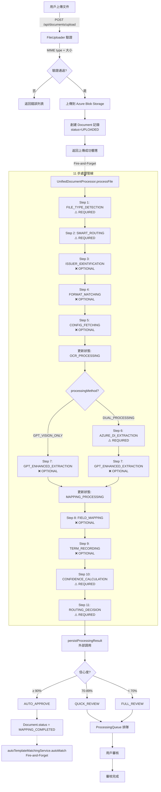
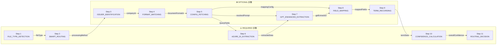

# 統一文件處理功能 - 深度分析報告

> **分析日期**: 2026-01-30
> **分析類型**: 架構分析
> **相關 Epic**: Epic 0, 2, 13, 14, 15
> **狀態**: 已完成
> **最後更新**: 2026-01-30（修正步驟順序，反映 CHANGE-005 調整）

---

## 執行摘要

本項目實現了一套**統一的文件處理系統**，從上傳到最終審核決策，涵蓋 **11 步處理管道**。系統採用**三層映射架構**（Universal → Company-Specific → AI/GPT），信心度路由機制確保準確率達 90-95%。

### 關鍵指標

| 指標 | 目標值 | 說明 |
|------|--------|------|
| 年處理量 | 450,000-500,000 張 | APAC 地區發票 |
| 自動化率 | 90-95% | 無需人工介入 |
| 準確率 | 90-95% | 提取正確率 |
| 節省人時 | 35,000-40,000 小時/年 | 效率提升 |

---

## 1. 文件上傳入口

### 1.1 主要上傳 API 端點

| 端點 | 方法 | 說明 | Epic |
|------|------|------|------|
| `/api/documents/upload` | POST | 單個/批量文件上傳（最多 20 個） | Epic 2 |
| `/api/v1/batches/` | POST | 批次數據上傳（歷史數據） | Epic 0 |
| `/api/documents/from-sharepoint/` | POST | SharePoint 文件同步 | Epic 9 |
| `/api/documents/from-outlook/` | POST | Outlook 郵件附件提取 | Epic 9 |

### 1.2 上傳組件和頁面

| 組件/頁面 | 位置 | 說明 |
|----------|------|------|
| **FileUploader** | `src/components/features/invoice/FileUploader.tsx` | 前端上傳組件（拖拽 + 文件選擇） |
| **BatchFileUploader** | `src/components/features/historical-data/BatchFileUploader.tsx` | 批次上傳組件（Epic 0） |
| **Document Upload Page** | `src/app/[locale]/(dashboard)/documents/upload` | 上傳頁面 |

### 1.3 支援的文件類型和限制

```typescript
// 支援的文件類型
const ALLOWED_TYPES = [
  'application/pdf',      // PDF
  'image/jpeg',           // JPEG
  'image/png',            // PNG
];

// 限制
const MAX_FILE_SIZE = 10 * 1024 * 1024;  // 10MB
const MAX_FILES_PER_UPLOAD = 20;          // 單次最多 20 個
```

### 1.4 上傳流程詳細步驟

```
POST /api/documents/upload
  │
  ├─ 1. 認證檢查 (NextAuth.js)
  │     └─ 驗證 INVOICE_CREATE 權限
  │
  ├─ 2. 檢查 Azure Storage 配置
  │
  ├─ 3. 解析 FormData
  │     ├─ files: File[] (FormData.getAll('files'))
  │     ├─ cityCode: string (必填 - Story 6.1)
  │     └─ autoExtract: boolean (默認 true)
  │
  ├─ 4. 驗證文件數量和格式
  │     ├─ 驗證 MIME type (isAllowedType)
  │     ├─ 驗證文件大小 (isAllowedSize)
  │     └─ 如驗證失敗 → 記錄到 failed[] 並繼續下一個
  │
  ├─ 5. 上傳文件到 Azure Blob Storage
  │     ├─ 轉換為 Buffer
  │     └─ uploadFile(buffer, fileName, { contentType, folder: cityCode })
  │
  ├─ 6. 創建資料庫記錄 (Document 表)
  │     ├─ fileName, fileType, fileExtension
  │     ├─ fileSize, filePath (blob URL), blobName
  │     ├─ status: 'UPLOADED'
  │     ├─ uploadedBy: session.user.id
  │     └─ cityCode: 城市代碼
  │
  ├─ 7. 觸發統一處理管線 (Fire-and-Forget)
  │     ├─ if ENABLE_UNIFIED_PROCESSOR === 'true'
  │     │     ├─ downloadBlob(blobName) → fileBuffer
  │     │     ├─ getUnifiedDocumentProcessor().processFile(input)
  │     │     ├─ persistProcessingResult(result)
  │     │     └─ autoTemplateMatchingService.autoMatch()
  │     │
  │     └─ else (Legacy fallback)
  │           └─ extractDocument(documentId)
  │
  └─ 8. 返回響應 (201 Created)
        {
          "success": true,
          "data": {
            "uploaded": [{ id, fileName, status }],
            "failed": [{ fileName, error }],
            "total": number,
            "successCount": number,
            "failedCount": number
          }
        }
```

---

## 2. 處理流程全景

### 2.1 統一處理管線 - 11 步驟架構

> **重要**: 以下順序反映 CHANGE-005 調整後的正確順序（2026-01-05）。
> 核心變更：將 ISSUER_IDENTIFICATION 移至 AZURE_DI_EXTRACTION 之前，
> 實現「先識別公司 → 再依配置動態提取」的流程。

```
┌──────────────────────────────────────────────────────────────────────────────┐
│ UnifiedDocumentProcessor - 11 步處理管線（Epic 15 + CHANGE-005）              │
├──────────────────────────────────────────────────────────────────────────────┤
│                                                                               │
│  STEP 1: FILE_TYPE_DETECTION (文件類型檢測) ⚠️ REQUIRED                       │
│  ├─ 輸入: Buffer + mimeType                                                  │
│  ├─ 邏輯: 檢測文件類型（Native PDF / Scanned PDF / Image）                    │
│  ├─ 超時: 5 秒                                                               │
│  └─ 輸出: context.fileType (NATIVE_PDF | SCANNED_PDF | IMAGE)                │
│                                                                               │
│  ┌──────────────────────────────────────────────┐                            │
│  │ PDF 檔案的雙重處理架構 (CHANGE-001)           │                            │
│  ├──────────────────────────────────────────────┤                            │
│  │ Native PDF:                                   │                            │
│  │  • DUAL_PROCESSING 模式                       │                            │
│  │  • GPT Vision: 分類 + Azure DI: 數據提取     │                            │
│  │                                              │                            │
│  │ Scanned PDF / Image:                         │                            │
│  │  • GPT_VISION_ONLY 模式                       │                            │
│  │  • GPT Vision: 完整提取                       │                            │
│  └──────────────────────────────────────────────┘                            │
│                                                                               │
│  STEP 2: SMART_ROUTING (智能路由決策) ⚠️ REQUIRED                             │
│  ├─ 輸入: context.fileType                                                   │
│  ├─ 邏輯: 根據文件類型決定處理方法                                            │
│  │  ├─ NATIVE_PDF → DUAL_PROCESSING (GPT 分類 + Azure DI 提取)              │
│  │  ├─ SCANNED_PDF/IMAGE → GPT_VISION_ONLY (純 GPT Vision)                  │
│  │  └─ Fallback → AZURE_DI_ONLY                                             │
│  ├─ 超時: 3 秒                                                               │
│  └─ 輸出: context.processingMethod                                           │
│                                                                               │
│  STEP 3: ISSUER_IDENTIFICATION (發行者識別) ❌ OPTIONAL [CHANGE-005]          │
│  ├─ 輸入: fileBuffer（轉為臨時文件）                                          │
│  ├─ 方法: GPT Vision classifyDocument() 輕量級分類                           │
│  ├─ 邏輯: 4 層搜尋 (Logo → Header → Letterhead → Footer)                    │
│  ├─ 超時: 30 秒 | 重試: 1 次                                                 │
│  ├─ 輸出: { companyId, companyName, isNewCompany, confidence }               │
│  └─ 注意: 如 autoCreateCompany=true，會自動創建新公司                         │
│                                                                               │
│  STEP 4: FORMAT_MATCHING (格式匹配) ❌ OPTIONAL [CHANGE-005]                  │
│  ├─ 輸入: companyId + fileType                                               │
│  ├─ 前置條件: 需要 Step 3 的 companyId                                       │
│  ├─ 邏輯: 匹配或創建文件格式（精確/相似度/AI 推斷）                           │
│  ├─ 超時: 10 秒 | 重試: 1 次                                                 │
│  ├─ 輸出: { documentFormatId, documentFormatName, isNewFormat }              │
│  └─ 注意: 如 autoCreateFormat=true，會自動創建新格式                          │
│                                                                               │
│  STEP 5: CONFIG_FETCHING (配置獲取) ❌ OPTIONAL [CHANGE-005]                  │
│  ├─ 輸入: companyId, documentFormatId                                        │
│  ├─ 前置條件: 需要 Step 3 和 Step 4 的結果                                   │
│  ├─ 邏輯: 三層範圍優先級 (FORMAT → COMPANY → GLOBAL)                         │
│  ├─ 並行獲取:                                                                │
│  │  ├─ PromptConfig (提示詞配置)                                            │
│  │  ├─ FieldMappingConfig (欄位映射規則)                                     │
│  │  └─ QueryFields (供 Step 6 Azure DI 動態提取使用)                         │
│  ├─ 超時: 5 秒 | 重試: 1 次                                                  │
│  └─ 輸出: { resolvedPrompt, mappingConfig, formatIdentificationRules }       │
│                                                                               │
│  STEP 6: AZURE_DI_EXTRACTION (Azure DI 提取) ⚠️ REQUIRED [CHANGE-005]        │
│  ├─ 輸入: fileBuffer + Step 5 的 QueryFields 配置                            │
│  ├─ 執行條件: processingMethod !== GPT_VISION_ONLY                           │
│  ├─ 客戶端: Azure Document Intelligence (prebuilt-document model)           │
│  ├─ 特性: 依據 Step 5 配置進行**動態欄位提取**                                │
│  ├─ 超時: 120 秒 | 重試: 2 次                                                │
│  └─ 輸出: { invoiceData, lineItems, rawAzureResponse, confidence }           │
│                                                                               │
│  STEP 7: GPT_ENHANCED_EXTRACTION (GPT 增強提取) ❌ OPTIONAL                   │
│  ├─ 輸入: fileBuffer + resolvedPrompt + formatIdentificationRules            │
│  ├─ 執行邏輯:                                                                │
│  │  ├─ DUAL_PROCESSING + 有 Prompt → 完整提取（額外欄位）                    │
│  │  ├─ DUAL_PROCESSING + 無 Prompt → 輕量級分類                              │
│  │  └─ GPT_VISION_ONLY → 完整提取                                            │
│  ├─ 方法: Base64 編碼 + GPT Vision API 調用                                  │
│  ├─ 超時: 60 秒 | 重試: 1 次                                                 │
│  └─ 輸出: { gptExtraction (extraCharges, typeOfService, extra_*) }           │
│                                                                               │
│  STEP 8: FIELD_MAPPING (欄位映射) ❌ OPTIONAL                                 │
│  ├─ 輸入: extractedData (Azure DI + GPT) + mappingConfig                     │
│  ├─ 架構: 三層映射系統                                                        │
│  │  ├─ Tier 1: Universal Mapping (通用規則，70-80% 覆蓋)                    │
│  │  ├─ Tier 2: Company-Specific (公司特定，10-15% 覆蓋)                     │
│  │  └─ Tier 3: LLM Classification (GPT-5.2，5-10% 覆蓋)                     │
│  ├─ 超時: 10 秒                                                              │
│  └─ 輸出: { mappedFields[], unmappedFields[], stats: {tier1, tier2, tier3} } │
│                                                                               │
│  STEP 9: TERM_RECORDING (術語記錄) ❌ OPTIONAL                                │
│  ├─ 輸入: extractedData + companyId + documentFormatId                       │
│  ├─ 術語來源:                                                                │
│  │  ├─ lineItems[] (行項目描述)                                             │
│  │  ├─ extraCharges[] (額外費用 - CHANGE-006)                               │
│  │  └─ typeOfService, extra_* (GPT 動態欄位)                                │
│  ├─ 邏輯: Levenshtein 距離匹配（85% 閾值）                                   │
│  │  ├─ 精確匹配 → 更新頻率                                                  │
│  │  ├─ 模糊匹配 → 更新 + 標記同義詞候選                                      │
│  │  └─ 未匹配 → 創建新術語                                                  │
│  ├─ 超時: 5 秒                                                               │
│  └─ 輸出: { totalDetected, newTermsCount, matchedTermsCount }                │
│                                                                               │
│  STEP 10: CONFIDENCE_CALCULATION (信心度計算) ⚠️ REQUIRED                     │
│  ├─ 輸入: 前 9 步的所有結果                                                  │
│  ├─ 7 維度加權計算:                                                          │
│  │  ├─ EXTRACTION (25%): OCR/GPT 提取品質                                   │
│  │  ├─ ISSUER_IDENTIFICATION (15%): 發行商識別準確度                        │
│  │  ├─ FORMAT_MATCHING (15%): 文件格式匹配程度                              │
│  │  ├─ CONFIG_MATCH (10%): 配置來源匹配（Format > Company > Global）       │
│  │  ├─ HISTORICAL_ACCURACY (15%): 歷史準確率                                │
│  │  ├─ FIELD_COMPLETENESS (10%): 欄位完整性                                 │
│  │  └─ TERM_MATCHING (10%): 術語匹配程度                                    │
│  ├─ 超時: 3 秒                                                               │
│  └─ 輸出: { overallConfidence (0-100), level, dimensions[], configBonus }    │
│                                                                               │
│  STEP 11: ROUTING_DECISION (路由決策) ⚠️ REQUIRED                             │
│  ├─ 輸入: overallConfidence                                                  │
│  ├─ 邏輯: 基於信心度三層路由                                                  │
│  │  ├─ ≥ 90%: AUTO_APPROVE - 自動批准，無需人工審核                         │
│  │  ├─ 70-89%: QUICK_REVIEW - 快速人工審核（一鍵確認修正）                  │
│  │  └─ < 70%: FULL_REVIEW - 完整人工審核（詳細檢查）                        │
│  ├─ 超時: 2 秒                                                               │
│  └─ 輸出: { routingDecision, recommendedAction }                             │
│                                                                               │
├──────────────────────────────────────────────────────────────────────────────┤
│  ⚠️ 注意: 管線結束後，由外部調用以下服務（非管線步驟）:                        │
│  ├─ persistProcessingResult() - 結果持久化到 ExtractionResult + Document     │
│  └─ autoTemplateMatchingService.autoMatch() - 自動模版匹配（Fire-and-Forget） │
└──────────────────────────────────────────────────────────────────────────────┘
```

### 2.1.1 步驟優先級說明

| 優先級 | 步驟數 | 步驟 | 失敗行為 |
|--------|--------|------|---------|
| **REQUIRED** | 5 | Step 1, 2, 6, 10, 11 | 中斷整個流程 |
| **OPTIONAL** | 6 | Step 3, 4, 5, 7, 8, 9 | 記錄警告並繼續 |

### 2.2 處理流程觸發方式

| 觸發方式 | API/方法 | 模式 | 使用場景 |
|---------|----------|------|----------|
| **自動觸發** | 上傳後 Fire-and-Forget | 異步 | 日常文件上傳 |
| **手動觸發** | `POST /api/documents/[id]/process` | 同步 | 重新處理 |
| **重試觸發** | `POST /api/documents/[id]/retry` | 異步 | 失敗重試 |
| **批次觸發** | `POST /api/v1/batches/` | 並發控制 | 歷史數據初始化 |

### 2.3 批次 vs 單一處理差異

| 處理方式 | API | 並發控制 | 使用場景 |
|---------|-----|----------|----------|
| **單一文件** | `/api/documents/upload` (1個) | 無 | 日常發票上傳 |
| **批量文件** | `/api/documents/upload` (2-20) | Promise.allSettled | 日常批量 |
| **批次處理** | `/api/v1/batches/` | p-queue (max 5) | 歷史數據初始化 |

---

## 3. 核心服務體系

### 3.1 服務分類總覽

```
┌────────────────────────────────────────────────────────────────┐
│ 文件處理服務矩陣                                               │
├────────────────────────────────────────────────────────────────┤
│                                                                │
│ ┌─ 核心 CRUD 服務                                              │
│ │  ├─ document.service.ts (文件列表、詳情、刪除)              │
│ │  ├─ document-progress.service.ts (進度追蹤)                │
│ │  └─ document-source.service.ts (來源管理)                  │
│ │                                                            │
│ ├─ 提取與映射服務                                              │
│ │  ├─ extraction.service.ts (Legacy OCR)                    │
│ │  ├─ azure-di.service.ts (Azure DI 提取)                  │
│ │  ├─ gpt-vision.service.ts (GPT-5.2 Vision)                │
│ │  ├─ mapping.service.ts (三層映射系統)                      │
│ │  └─ unified-processor/ (11 步管線)                         │
│ │     ├─ unified-document-processor.service.ts               │
│ │     ├─ steps/ (11 個步驟實現)                               │
│ │     └─ adapters/ (Legacy 適配器)                           │
│ │                                                            │
│ ├─ 信心度與路由服務                                            │
│ │  ├─ confidence.service.ts (信心度計算 + 歷史準確率)       │
│ │  ├─ routing.service.ts (路由決策 + 隊列管理)              │
│ │  └─ historical-accuracy.service.ts (準確率追蹤)          │
│ │                                                            │
│ ├─ 公司與術語服務                                              │
│ │  ├─ company.service.ts (公司 CRUD)                        │
│ │  ├─ company-matcher.service.ts (公司匹配)                │
│ │  ├─ company-auto-create.service.ts (Just-in-Time 創建)   │
│ │  ├─ term-classification.service.ts (術語分類)            │
│ │  └─ batch-term-aggregation.service.ts (術語聚合)         │
│ │                                                            │
│ ├─ 識別服務                                                   │
│ │  ├─ document-issuer.service.ts (發行方識別)              │
│ │  ├─ document-format.service.ts (格式識別)                │
│ │  └─ file-detection.service.ts (公司識別)                │
│ │                                                            │
│ └─ 整合服務                                                   │
│    ├─ batch-processor.service.ts (批次執行器)              │
│    ├─ processing-result-persistence.service.ts (結果持久化)│
│    └─ auto-template-matching.service.ts (自動模版匹配)      │
│                                                            │
└────────────────────────────────────────────────────────────────┘
```

### 3.2 核心服務詳細說明

| 服務 | 文件位置 | 職責 | 核心方法 |
|------|----------|------|---------|
| **document.service** | `src/services/document.service.ts` | 文件 CRUD、狀態管理 | `getDocuments()`, `retryProcessing()` |
| **azure-di.service** | `src/services/azure-di.service.ts` | Azure DI 提取 | `processPdfWithAzureDI()` |
| **gpt-vision.service** | `src/services/gpt-vision.service.ts` | GPT Vision 提取 | `processImageWithVision()` |
| **mapping.service** | `src/services/mapping.service.ts` | 三層映射 | `getMappingRules()`, `getApplicableRules()` |
| **confidence.service** | `src/services/confidence.service.ts` | 信心度計算 | `calculateAndSaveConfidence()` |
| **routing.service** | `src/services/routing.service.ts` | 路由決策 | `routeDocument()`, `getProcessingQueue()` |
| **unified-processor** | `src/services/unified-processor/` | 11 步管線 | `processFile()` |

---

## 4. 數據流向和模型

### 4.1 主要資料庫模型

```
┌────────────────────────────────────────────────────────────────┐
│ 核心資料庫模型                                                 │
├────────────────────────────────────────────────────────────────┤
│                                                                │
│  Document (文件主記錄)                                         │
│  ├─ id, fileName, fileType, fileExtension                    │
│  ├─ fileSize, filePath (Azure Blob URL), blobName           │
│  ├─ status (UPLOADED, OCR_PROCESSING, MAPPING_COMPLETED...)  │
│  ├─ uploadedBy, cityCode, companyId                          │
│  ├─ processingPath, routingDecision (JSON)                   │
│  ├─ processingStartedAt, processingEndedAt                   │
│  └─ 關聯: ocrResult, extractionResult, processingQueue       │
│                                                                │
│  ExtractionResult (統一提取結果 - Epic 15)                    │
│  ├─ documentId (FK), extractionStatus                        │
│  ├─ extractedText, rawResult, invoiceData                    │
│  ├─ unmappedFields, confidenceScores (JSON)                 │
│  ├─ processingPath, routingDecision                          │
│  ├─ overallConfidence, warnings                              │
│  └─ 通過 processing-result-persistence.service 保存           │
│                                                                │
│  ProcessingQueue (審核隊列)                                   │
│  ├─ documentId (FK)                                          │
│  ├─ processingPath (AUTO_APPROVE, QUICK_REVIEW, FULL_REVIEW) │
│  ├─ priority, queueStatus, assignedUser                     │
│  └─ createdAt, completedAt                                   │
│                                                                │
│  DocumentProcessingStage (進度追蹤)                           │
│  ├─ documentId (FK)                                          │
│  ├─ stage (FILE_TYPE_DETECTION, ISSUER_IDENTIFICATION...)   │
│  ├─ status (PENDING, IN_PROGRESS, COMPLETED)                │
│  └─ startedAt, completedAt, durationMs, result, error        │
│                                                                │
│  MappingRule (映射規則)                                       │
│  ├─ companyId (null = Universal, else Company-Specific)     │
│  ├─ fieldName, extractionPattern                             │
│  ├─ priority, isRequired, isActive                           │
│  └─ validationPattern, defaultValue                          │
│                                                                │
│  FieldMappingConfig (欄位映射配置 - Epic 13)                  │
│  ├─ scope (GLOBAL, COMPANY, FORMAT)                         │
│  ├─ companyId, documentFormatId                              │
│  └─ version (樂觀鎖)                                         │
│                                                                │
│  PromptConfig (提示詞配置 - Epic 14)                          │
│  ├─ promptType (ISSUER_IDENTIFICATION, FIELD_EXTRACTION...)  │
│  ├─ scope (GLOBAL, COMPANY, FORMAT)                         │
│  ├─ systemPrompt, userPromptTemplate                         │
│  └─ variables, mergeStrategy, version                        │
│                                                                │
│  Company (公司)                                               │
│  ├─ id, name, code                                           │
│  ├─ identificationMethods (JSON)                             │
│  └─ 關聯: documents, mappingRules                             │
│                                                                │
│  DocumentFormat (文件格式)                                    │
│  ├─ id, formatName, documentType                             │
│  ├─ features (JSON)                                          │
│  └─ 關聯: documents, fieldMappingConfigs                      │
│                                                                │
└────────────────────────────────────────────────────────────────┘
```

### 4.2 狀態流轉圖

```
Document 狀態流程（反映 CHANGE-005 + CHANGE-019）
───────────────────────────────────────────────

UPLOADED
   │
   ├─ 自動觸發: UnifiedDocumentProcessor.processFile()
   │
   ├─ Step 1-5: 文件分析和配置獲取（無狀態更新）
   │   ├─ FILE_TYPE_DETECTION
   │   ├─ SMART_ROUTING
   │   ├─ ISSUER_IDENTIFICATION
   │   ├─ FORMAT_MATCHING
   │   └─ CONFIG_FETCHING
   │
   ▼
OCR_PROCESSING (進入 Step 6 前更新 - CHANGE-019)
   │
   ├─ Step 6: AZURE_DI_EXTRACTION
   │   └─ Azure DI / GPT Vision 提取中
   │
   ├─ Step 7: GPT_ENHANCED_EXTRACTION
   │
   ▼
MAPPING_PROCESSING (進入 Step 8 前更新 - CHANGE-019)
   │
   ├─ Step 8: FIELD_MAPPING
   │   └─ 三層映射執行中
   │
   ├─ Step 9: TERM_RECORDING
   │
   ├─ Step 10: CONFIDENCE_CALCULATION
   │
   ▼
┌─────────────────────────────────────────┐
│          路由決策 (Step 11)              │
├─────────────────────────────────────────┤
│                                         │
│  ≥ 90% ──→ AUTO_APPROVE ──→ COMPLETED   │
│            (無需人工審核)                │
│                                         │
│  70-89% ─→ QUICK_REVIEW                 │
│            └─→ ProcessingQueue          │
│            └─→ 用戶確認後 → COMPLETED    │
│                                         │
│  < 70% ──→ FULL_REVIEW                  │
│            └─→ ProcessingQueue (高優先)  │
│            └─→ 詳細審核後 → COMPLETED    │
│                                         │
└─────────────────────────────────────────┘
   │
   ├─ persistProcessingResult() → 更新 Document + ExtractionResult
   │
   └─ autoTemplateMatchingService.autoMatch() (Fire-and-Forget)

失敗路徑:
─────────
REQUIRED 步驟失敗 (Step 1, 2, 6, 10, 11)
   └─→ OCR_FAILED / FAILED
       └─→ 可通過 /retry 重試

OPTIONAL 步驟失敗 (Step 3, 4, 5, 7, 8, 9)
   └─→ 記錄警告 → 繼續執行
```

### 4.3 與其他模組的數據交互

```
Document Extraction System
    │
    ├─→ ProcessingQueue Module (審核工作流 - Epic 3)
    │   └─ 路由決策 → QUICK_REVIEW/FULL_REVIEW → 提交到隊列
    │
    ├─→ Rule Management Module (映射規則 - Epic 4)
    │   ├─ 讀: MappingRule (欄位映射)
    │   └─ 寫: 新術語 → 規則建議
    │
    ├─→ Company Configuration Module (公司管理 - Epic 5)
    │   ├─ 讀: Company (識別發行方)
    │   └─ 寫: JIT 創建新公司
    │
    ├─→ City Isolation Module (城市隔離 - Epic 6)
    │   └─ 讀/寫: Document.cityCode
    │
    ├─→ Cost Tracking Module (成本追蹤 - Epic 7)
    │   └─ 寫: AI 成本記錄
    │
    ├─→ Audit & Compliance Module (審計 - Epic 8)
    │   └─ 寫: 審計日誌
    │
    ├─→ Document Source Module (文件來源 - Epic 9)
    │   └─ Document.sourceType, sourceMetadata
    │
    ├─→ Config Management Module (配置 - Epic 13-14)
    │   ├─ 讀: FieldMappingConfig
    │   └─ 讀: PromptConfig
    │
    └─→ Template Matching Module (模版匹配)
        └─ 自動觸發: autoTemplateMatchingService.autoMatch()
```

---

## 5. 三層映射系統

### 5.1 架構說明

```
┌─────────────────────────────────────────────────────────────────┐
│ TIER 1: Universal Mapping（通用層）                              │
│ • 覆蓋 70-80% 常見術語                                          │
│ • 所有公司通用                                                  │
│ • MappingRule.companyId = null                                 │
│ • 維護成本：低（只需維護一份）                                   │
├─────────────────────────────────────────────────────────────────┤
│ TIER 2: Company-Specific Override（特定覆蓋層）                  │
│ • 額外覆蓋 10-15%                                               │
│ • 只記錄與通用規則「不同」的映射                                 │
│ • MappingRule.companyId = specific company                     │
│ • 維護成本：中（每個公司只需記錄差異）                           │
├─────────────────────────────────────────────────────────────────┤
│ TIER 3: LLM Classification（AI 智能分類）                        │
│ • 剩餘 5-10% 覆蓋                                               │
│ • 使用 GPT-5.2 智能分類                                         │
│ • 可處理從未見過的新術語                                         │
│ • 維護成本：無（全自動）                                         │
└─────────────────────────────────────────────────────────────────┘
```

### 5.2 映射優先級

```
查詢順序:
1. Tier 2 (Company-Specific) - 如匹配 → 返回
2. Tier 1 (Universal) - 如匹配 → 返回
3. Tier 3 (LLM Classification) - 總是可用
```

---

## 6. 信心度路由機制

### 6.1 信心度計算

```typescript
// 計算步驟
1. 各欄位信心度 = (提取成功率 + 歷史準確率) / 2
2. 關鍵欄位懲罰: 如關鍵欄位缺失 → 整體信心度 -20%
3. 文件整體信心度 = 加權平均(欄位信心度)
```

### 6.2 路由決策

| 信心度範圍 | 處理方式 | 說明 |
|-----------|----------|------|
| ≥ 90% | AUTO_APPROVE | 自動通過，無需人工介入 |
| 70-89% | QUICK_REVIEW | 快速人工確認（一鍵確認/修正） |
| < 70% | FULL_REVIEW | 完整人工審核（詳細檢查） |

### 6.3 常數定義

```typescript
// src/services/index.ts
export const CONFIDENCE_THRESHOLD_HIGH = 90;    // AUTO_APPROVE
export const CONFIDENCE_THRESHOLD_MEDIUM = 70;  // QUICK_REVIEW
```

---

## 7. 動態 Prompt 系統 (Epic 14)

### 7.1 Prompt 類型

| 類型 | 說明 |
|------|------|
| ISSUER_IDENTIFICATION | 發行方識別 |
| FIELD_EXTRACTION | 欄位提取 |
| TERM_CLASSIFICATION | 術語分類 |
| VALIDATION | 驗證 |

### 7.2 範圍優先級

```
GLOBAL → COMPANY → FORMAT（越具體優先級越高）
```

### 7.3 合併策略

| 策略 | 說明 |
|------|------|
| OVERRIDE | 完全覆蓋父層配置 |
| APPEND | 附加到父層配置末尾 |
| PREPEND | 插入到父層配置開頭 |

---

## 8. 錯誤處理和重試機制

### 8.1 錯誤處理策略

```
處理管線異常
    │
    ├─ Step 執行失敗
    │  ├─ 可恢復錯誤 → 記錄 warning → 繼續執行
    │  └─ 不可恢復錯誤 → 中斷管線 → 標記 FAILED
    │
    └─ 整個管線失敗
       ├─ 儲存錯誤詳情到 ExtractionResult
       ├─ 標記 Document.status = FAILED
       └─ 返回 success: false
```

### 8.2 重試機制

```typescript
// 重試 API: POST /api/documents/[id]/retry

重試流程:
1. 清除舊結果 (ProcessingQueue, ExtractionResult)
2. 重置 Document.processingPath = null
3. 重新下載文件
4. 調用 UnifiedDocumentProcessor.processFile()
5. 重新持久化結果

可重試狀態:
- OCR_FAILED
- FAILED
- UPLOADED
- OCR_COMPLETED
- MAPPING_COMPLETED
```

---

## 9. 性能配置

### 9.1 處理限制

| 配置項 | 值 | 說明 |
|--------|-----|------|
| MAX_FILE_SIZE | 10 MB | 單個文件最大 |
| MAX_FILES_PER_UPLOAD | 20 | 單次上傳最多 |
| PROCESSING_TIMEOUT | 120 秒 | 處理超時 |
| AZURE_DI_TIMEOUT | 60 秒 | Azure DI 超時 |
| GPT_VISION_TIMEOUT | 60 秒 | GPT Vision 超時 |
| MAX_CONCURRENT_BATCH | 5 | 批次最大並發 |

### 9.2 處理時間估算

| 文件類型 | 預估時間 |
|---------|----------|
| Native PDF | 6-10 秒 |
| Scanned PDF | 8-15 秒 |
| Image | 5-10 秒 |

---

## 10. 功能標誌 (Feature Flags)

| 標誌 | 說明 | 預設值 |
|------|------|--------|
| ENABLE_UNIFIED_PROCESSOR | 統一處理管線啟用 | true |
| ENABLE_DYNAMIC_PROMPT | 動態 Prompt 啟用 | true |
| USE_LEGACY_ON_ERROR | Legacy 處理器降級 | true |
| ENABLE_AUTO_TEMPLATE_MATCHING | 自動模版匹配 | true |

---

## 11. 完整流程圖 (Mermaid)

> **注意**: 以下流程圖反映 CHANGE-005 調整後的正確順序。



### 11.1 步驟依賴關係圖



---

## 12. 已知限制和技術債務

| 項目 | 說明 | 狀態 |
|------|------|------|
| Native PDF 雙重處理 | CHANGE-001 實現中 | 🚧 進行中 |
| Legacy OCR 退役 | 計劃移除 extractDocument() | ⏸️ 待規劃 |
| Prompt V3 優化 | Story 0-11 持續優化 | ⏸️ 待規劃 |
| 多語言 Prompt | 非英語公司的 Prompt | ⏸️ 待規劃 |

---

## 13. 相關文件索引

### 核心服務文件

| 文件 | 說明 |
|------|------|
| `src/services/unified-processor/unified-document-processor.service.ts` | 統一處理器主入口 |
| `src/services/unified-processor/steps/` | 11 步驟實現 |
| `src/services/azure-di.service.ts` | Azure DI 服務 |
| `src/services/gpt-vision.service.ts` | GPT Vision 服務 |
| `src/services/mapping.service.ts` | 映射服務 |
| `src/services/confidence.service.ts` | 信心度服務 |
| `src/services/routing.service.ts` | 路由服務 |
| `src/services/processing-result-persistence.service.ts` | 結果持久化 |

### API 路由文件

| 文件 | 說明 |
|------|------|
| `src/app/api/documents/upload/route.ts` | 上傳 API |
| `src/app/api/documents/[id]/process/route.ts` | 處理 API |
| `src/app/api/documents/[id]/retry/route.ts` | 重試 API |
| `src/app/api/documents/[id]/progress/route.ts` | 進度 API |

### 資料庫 Schema

| 位置 | 說明 |
|------|------|
| `prisma/schema.prisma` | Document, ExtractionResult 等模型 |

---

## 總結

本項目通過**統一的 11 步處理管線**和**三層映射系統**，實現了高度自動化的發票提取和分類。

**核心亮點：**
- ✅ **統一入口**: UnifiedDocumentProcessor 提供一致的處理 API
- ✅ **11 步管線**: 從文件類型到路由決策的完整流程（CHANGE-005 優化順序）
- ✅ **智能路由**: Step 2 SMART_ROUTING 根據文件類型選擇最佳處理方法
- ✅ **先識別後提取**: Step 3-5 先識別公司/格式/配置，再進行 Step 6 動態提取
- ✅ **雙重 OCR**: Azure DI (結構化) + GPT Vision (靈活)
- ✅ **三層映射**: 通用 → 公司特定 → AI 智能
- ✅ **7 維度信心度**: 多維度加權計算，精準路由決策
- ✅ **持續術語學習**: Step 9 TERM_RECORDING 自動發現和記錄新術語
- ✅ **動態 Prompt**: 提示詞配置系統
- ✅ **自動模版匹配**: 自動關聯模版

**11 步管線正確順序（CHANGE-005）：**
```
Step 1:  FILE_TYPE_DETECTION      ⚠️ REQUIRED
Step 2:  SMART_ROUTING            ⚠️ REQUIRED
Step 3:  ISSUER_IDENTIFICATION    ❌ OPTIONAL
Step 4:  FORMAT_MATCHING          ❌ OPTIONAL
Step 5:  CONFIG_FETCHING          ❌ OPTIONAL
Step 6:  AZURE_DI_EXTRACTION      ⚠️ REQUIRED
Step 7:  GPT_ENHANCED_EXTRACTION  ❌ OPTIONAL
Step 8:  FIELD_MAPPING            ❌ OPTIONAL
Step 9:  TERM_RECORDING           ❌ OPTIONAL
Step 10: CONFIDENCE_CALCULATION   ⚠️ REQUIRED
Step 11: ROUTING_DECISION         ⚠️ REQUIRED
```

**注意**: 結果持久化（persistProcessingResult）是管線完成後的外部調用，不是 11 步管線的一部分。

---

**文檔建立日期**: 2026-01-30
**最後更新日期**: 2026-01-30
**作者**: AI Assistant (Claude)
**版本**: 1.1.0

### 更新記錄

| 版本 | 日期 | 變更內容 |
|------|------|---------|
| 1.1.0 | 2026-01-30 | 修正步驟順序反映 CHANGE-005；加入 SMART_ROUTING；TERM_CLASSIFICATION → TERM_RECORDING；移除 RESULT_PERSISTENCE（非管線步驟）；更新 Mermaid 流程圖 |
| 1.0.0 | 2026-01-30 | 初始版本 |
