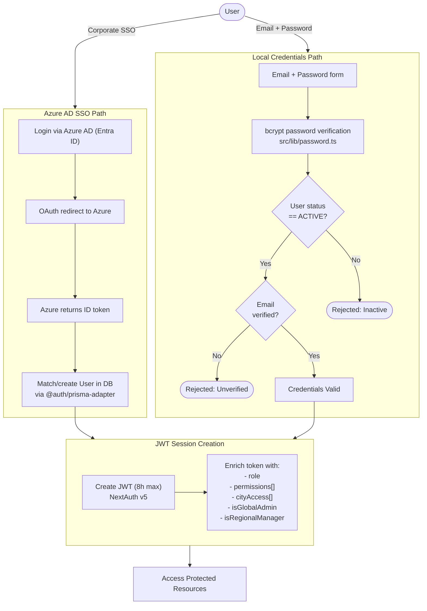
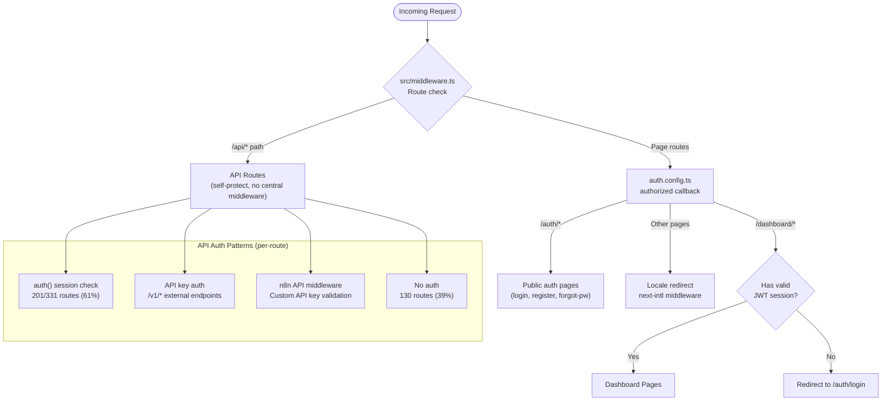
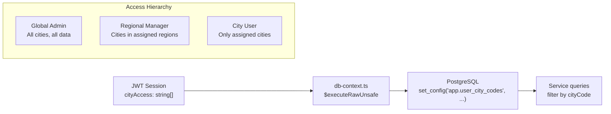

# Authentication & Authorization Flow

> Generated: 2026-04-09 | Source: security-audit.md, integration-map.md, architecture-patterns.md

## Dual Authentication Paths

## Route Protection Architecture

## City-Based Access Control (RLS)

## Permission Model

| Concept | Implementation | Key Models |
|---------|---------------|------------|
| **Authentication** | NextAuth v5 (Azure AD + Credentials) | User, Account, Session |
| **Session** | JWT-based, 8h max, stateless | VerificationToken |
| **Roles** | RBAC with permissions array | Role, UserRole |
| **City Access** | Per-user city assignment | UserCityAccess, City |
| **Region Access** | Regional manager access | UserRegionAccess, Region |
| **API Keys** | External API access (n8n, v1) | ApiKey, N8nApiKey, ExternalApiKey |

## Auth Coverage Summary

| Domain | Coverage | Notes |
|--------|----------|-------|
| /admin/* | 91% | Well protected |
| /rules/*, /review/*, /audit/* | 100% | Fully protected |
| /documents/* | 79% | Some gaps |
| /v1/* | 17% | HIGH risk -- 64 unprotected routes |
| /cost/*, /dashboard/*, /statistics/* | 0% | HIGH risk -- no auth |
| **Overall** | **61%** (201/331) | Needs improvement |
