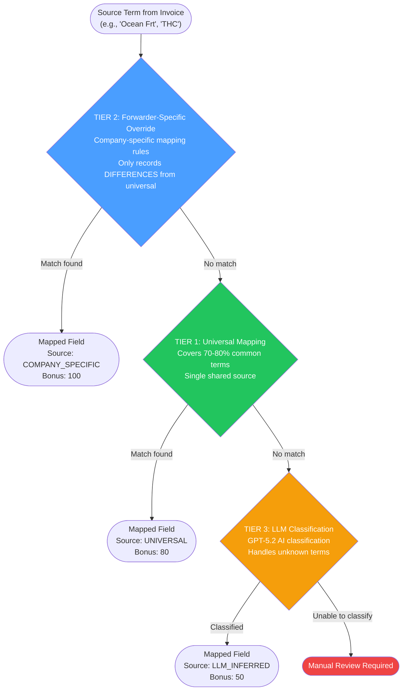
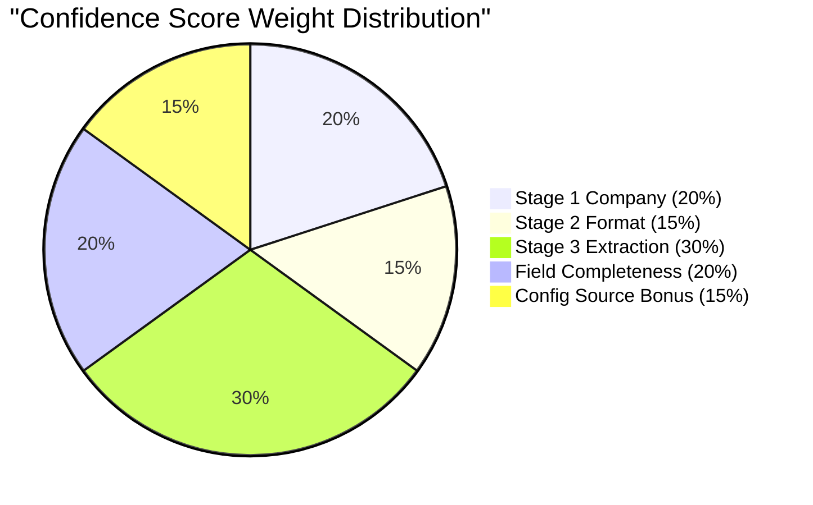
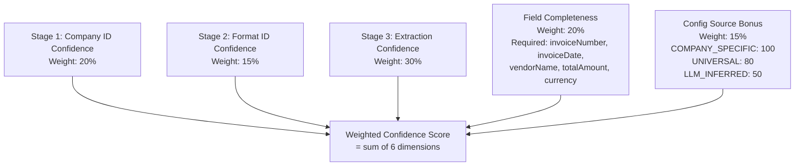
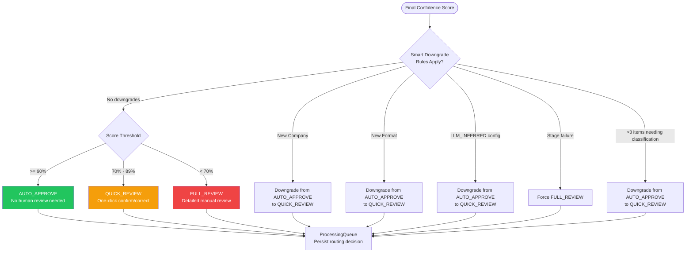
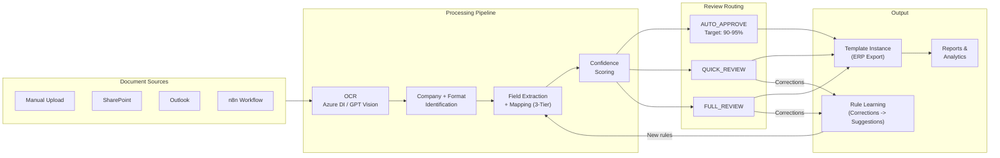

# Business Process Flows - Three-Tier Mapping & Confidence Routing

> Generated: 2026-04-09 | Source: architecture-patterns.md, services-core-pipeline.md, services-overview.md

## Three-Tier Mapping Architecture

## Confidence Scoring - Six Dimensions (V3.1)

## Confidence Routing Decision

> **Note on smart downgrade implementation**: In `generateRoutingDecision()` (confidence-v3-1.service.ts), new company / new format / LLM_INFERRED config / >3 classification items all only downgrade AUTO_APPROVE to QUICK_REVIEW. Only stage failure forces FULL_REVIEW. The project CLAUDE.md documents a stricter design ("New Company -> Force FULL_REVIEW") which is not reflected in the main pipeline code -- the documented behavior may exist in a separate validation layer or represent a planned enhancement.

## End-to-End Business Flow

## Prompt Config Resolution Hierarchy

| Priority | Scope | Description |
|----------|-------|-------------|
| 1 (highest) | FORMAT | Format-specific prompt for a specific company's document layout |
| 2 | COMPANY | Company-specific prompt (applies to all formats) |
| 3 (lowest) | GLOBAL | Default fallback prompt (applies to all companies) |

If no DB config found, hardcoded fallback prompts are used (defined in stage services).
