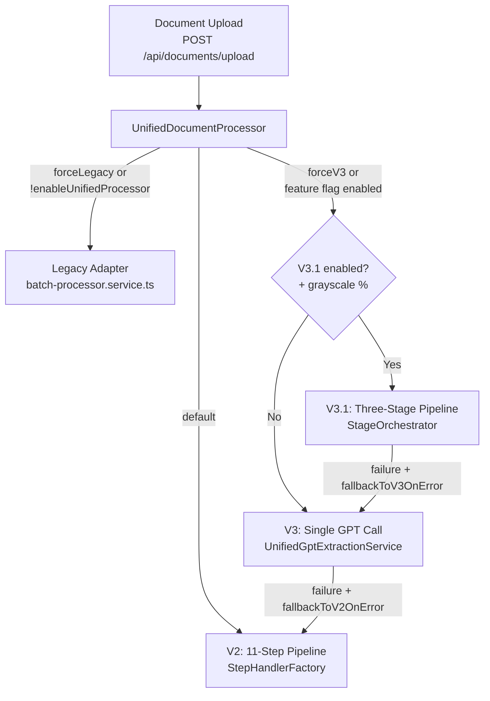
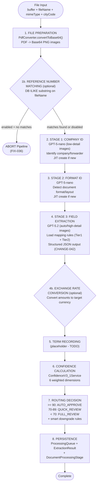

# Data Flow - Document Processing Pipeline

> Generated: 2026-04-09 | Source: services-core-pipeline.md, architecture-patterns.md

## Pipeline Version Routing

The `UnifiedDocumentProcessor` selects the processing path based on feature flags.

## V3.1 Pipeline - Primary Path (Detailed)

## V2 Pipeline - 11 Steps

```mermaid
flowchart LR
    S01["1. File Type<br/>Detection"] --> S02["2. Smart<br/>Routing"]
    S02 --> S03["3. Azure DI<br/>OCR"]
    S03 --> S04["4. Issuer<br/>Identification"]
    S04 --> S05["5. Format<br/>Matching"]
    S05 --> S06["6. Config<br/>Fetching"]
    S06 --> S07["7. GPT Enhanced<br/>Extraction"]
    S07 --> S08["8. Field<br/>Mapping"]
    S08 --> S09["9. Term<br/>Recording"]
    S09 --> S10["10. Confidence<br/>Calculation"]
    S10 --> S11["11. Routing<br/>Decision"]
```

## Key Differences Between Versions

| Aspect | V2 (11-Step) | V3 (Single Call) | V3.1 (Three-Stage) |
|--------|-------------|-----------------|-------------------|
| OCR | Azure Document Intelligence | GPT-5.2 Vision | GPT-5.2 Vision |
| GPT Calls | 1 (enhanced extraction) | 1 (unified) | 3 (nano+nano+full) |
| Company ID | Adapter-based | Single GPT output | Dedicated Stage 1 |
| Format ID | Adapter-based | Single GPT output | Dedicated Stage 2 |
| Fallback | None | Falls back to V2 | Falls back to V3 |
| Config | Adapter-fetched | Prompt assembly | Per-stage prompt config |
