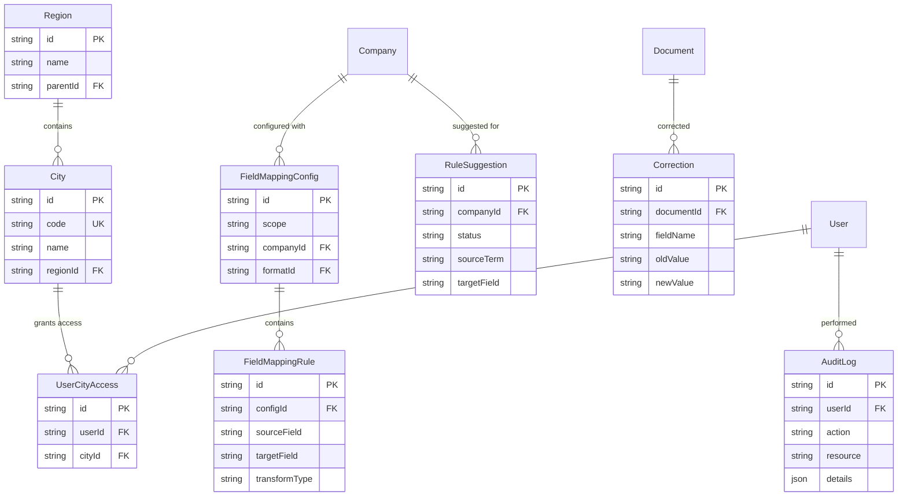

# ER Diagrams - Key Model Relationships

> Generated: 2026-04-09 | Source: prisma-model-inventory.md (122 models total, 20 key models shown)

## Core Domain Models

```mermaid
erDiagram
    User {
        string id PK
        string email UK
        string name
        string role
        string status
    }

    Document {
        string id PK
        string fileName
        string status
        string mimeType
        string blobPath
        string cityCode
        string userId FK
        string companyId FK
    }

    Company {
        string id PK
        string name
        string code UK
        boolean isActive
        string mergedIntoId FK
    }

    DocumentFormat {
        string id PK
        string name
        string companyId FK
        string pattern
    }

    ExtractionResult {
        string id PK
        string documentId FK
        json standardFields
        json lineItems
        float confidenceScore
        string reviewType
        string companyId FK
    }

    OcrResult {
        string id PK
        string documentId FK
        json rawText
        float confidence
    }

    ProcessingQueue {
        string id PK
        string documentId FK
        string assigneeId FK
        string reviewType
        string status
    }

    ReviewRecord {
        string id PK
        string documentId FK
        string reviewerId FK
        string action
        json changes
    }

    MappingRule {
        string id PK
        string fieldName
        string fieldLabel
        json extractionPattern
        string companyId FK
        string forwarderId FK
        float confidence
        string status
        boolean isActive
        int version
    }

    PromptConfig {
        string id PK
        string scope
        string stage
        string companyId FK
        string formatId FK
        json systemPrompt
    }

    Escalation {
        string id PK
        string documentId FK UK
        string escalatedBy FK
        string reason
        string reasonDetail
        string status
        string assignedTo FK
        string resolution
        string resolvedBy FK
    }

    DocumentProcessingStage {
        string id PK
        string documentId FK
        string stage
        string stageName
        int stageOrder
        string status
        int durationMs
        json result
        string error
    }

    UserRole {
        string id PK
        string userId FK
        string roleId FK
        string cityId FK
    }

    Role {
        string id PK
        string name UK
        string description
        string[] permissions
        boolean isSystem
    }

    User ||--o{ Document : "uploads"
    User ||--o{ ReviewRecord : "reviews"
    User ||--o{ ProcessingQueue : "assigned to"
    User ||--o{ UserRole : "has roles"
    User ||--o{ Escalation : "escalates"
    Role ||--o{ UserRole : "assigned to users"
    Document ||--o| OcrResult : "has"
    Document ||--o| ExtractionResult : "has"
    Document ||--o| ProcessingQueue : "queued in"
    Document ||--o{ ReviewRecord : "reviewed by"
    Document ||--o| Escalation : "escalated"
    Document ||--o{ DocumentProcessingStage : "tracked by"
    Company ||--o{ Document : "identified in"
    Company ||--o{ DocumentFormat : "has formats"
    Company ||--o{ MappingRule : "has rules"
    Company ||--o{ ExtractionResult : "extracted for"
    DocumentFormat ||--o{ PromptConfig : "configured with"
    Company ||--o{ PromptConfig : "configured with"
```

## Supporting Models



## Model Statistics

| Domain | Models | Key Entity |
|--------|--------|-----------|
| User & Auth | 8 | User, Role, UserRole, UserCityAccess |
| Document Processing | 7 | Document, ExtractionResult, ProcessingQueue, DocumentProcessingStage |
| Company | 3 | Company, Forwarder (deprecated) |
| Mapping & Rules | 12 | MappingRule, FieldMappingConfig |
| Review & Correction | 7 | ReviewRecord, Correction, Escalation |
| Audit & Security | 5 | AuditLog, SecurityLog |
| System Config | 4 | SystemConfig, PipelineConfig |
| Performance | 11 | ServiceHealthCheck, ApiPerformanceMetric |
| Other (14 domains) | 65 | Various integration and support models |
| **Total** | **122** | |
