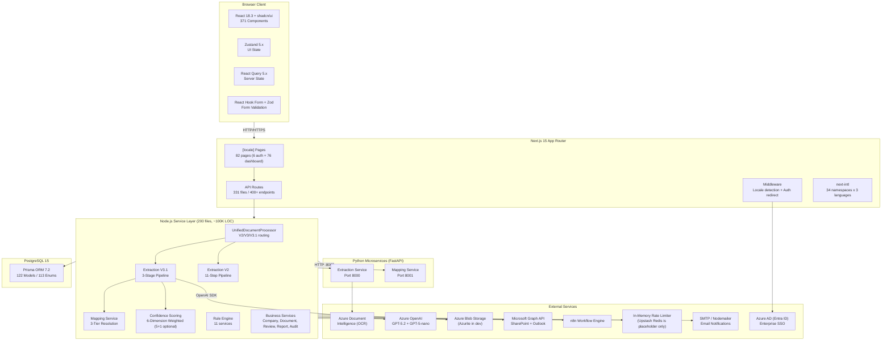

# System Architecture - High-Level Diagram

> Generated: 2026-04-09 | Source: architecture-patterns.md, integration-map.md, services-overview.md

This diagram shows the overall system architecture including the Next.js frontend, API layer, service layer, database, Python microservices, and all external service integrations.

## Layer Responsibilities

| Layer | Responsibility | Key Metrics |
|-------|---------------|-------------|
| **Client** | UI rendering, state management, form validation | 371 components, 104 hooks |
| **Next.js** | Routing, i18n, middleware, API endpoints | 82 pages, 331 route files |
| **Service** | Business logic, pipeline orchestration, rules | 200 files, ~100K LOC |
| **Python** | OCR extraction, mapping resolution | 2 FastAPI services |
| **Database** | Persistence, audit trails | 122 Prisma models |
| **External** | AI, storage, email, auth, workflow automation | 9 integration categories |
