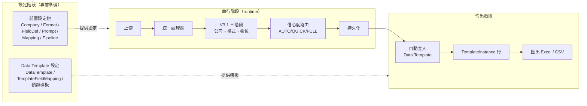
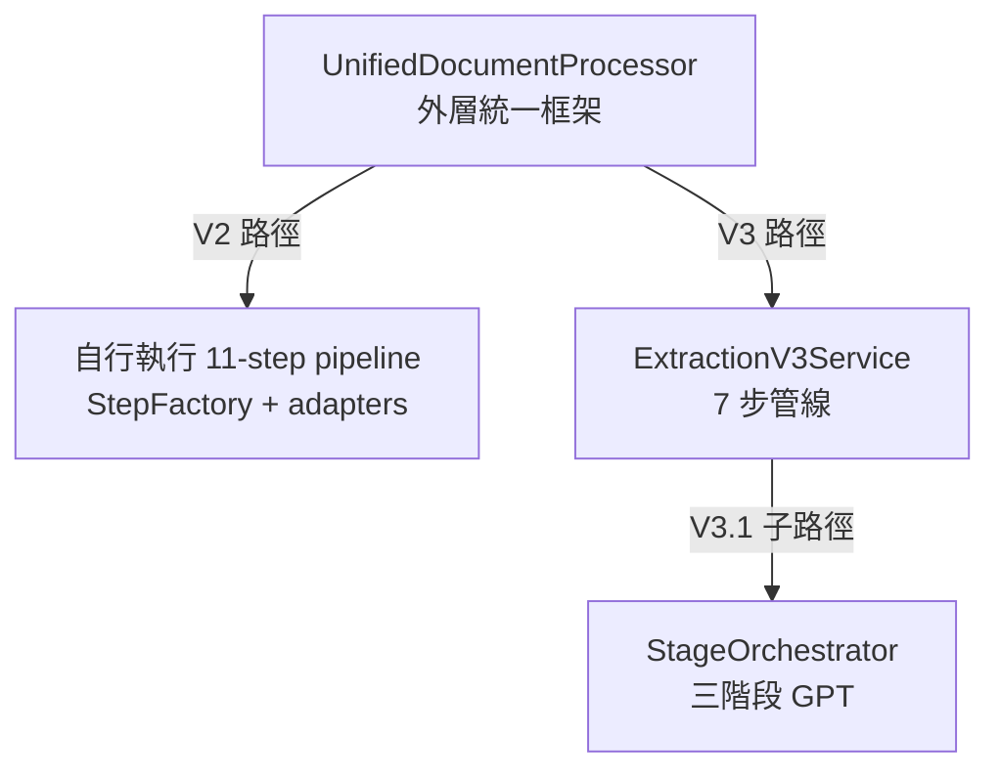
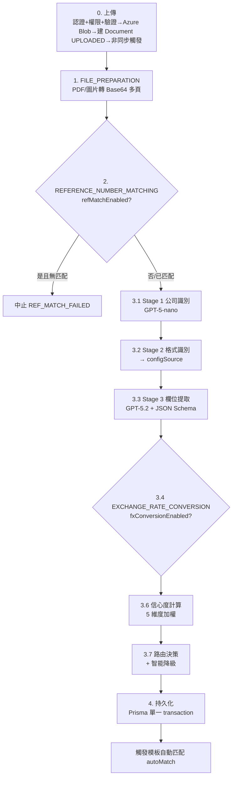
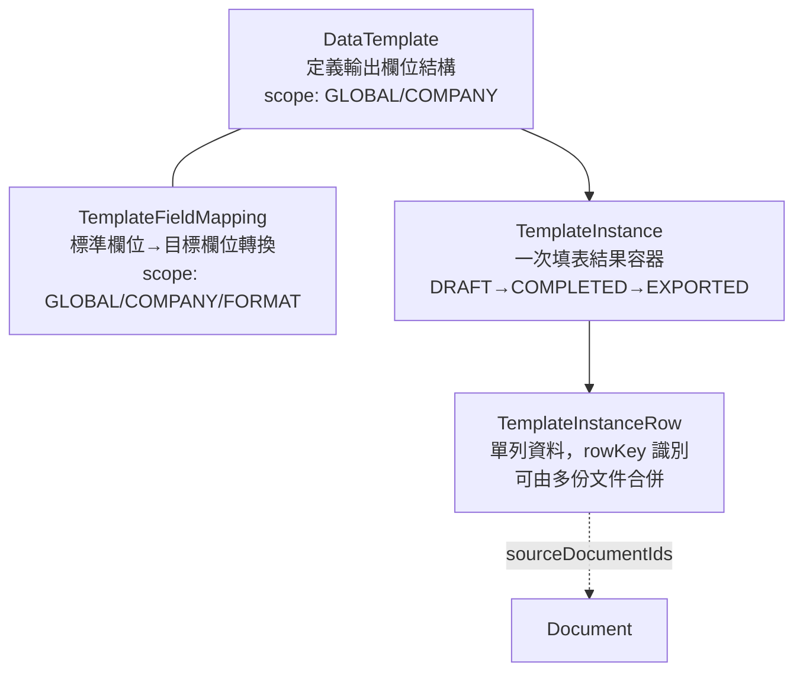
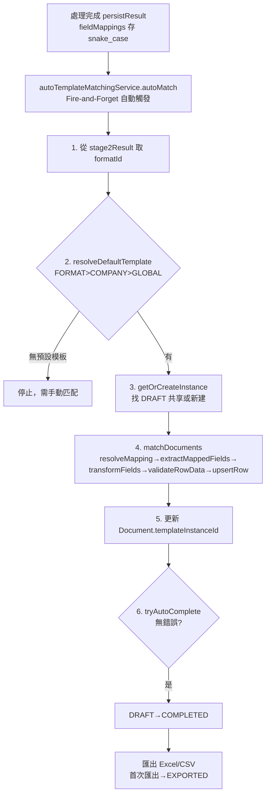

# 端到端功能架構流程說明：前置設定 → 文件處理 → Data Template

> **項目**：AI Document Extraction System（Ricoh SCM Freight Invoice 自動化）
> **文檔產出日期**：2026-05-31
> **Codebase 快照**：Branch `main`
> **產出方式**：4 個並行探索 Agent 掃描最新代碼 + 開發記錄（`claudedocs/4-changes/` 70 CHANGE + 56 FIX、`docs/06-codebase-analyze/`、`docs/open-questions.md`）後交叉印證彙整
> **定位**：本文為**跨層綜合流程說明**，補充 2026-04-09 codebase 分析批次（80 份）中分散於各模組的內容。模組級細節仍以 `02-module-mapping/`、`03-database/`、`04-diagrams/` 為準。
> **重要前提**：信心度閾值以**代碼實際值 90% / 70%** 為準（`confidence-v3-1.service.ts:112-118`），文檔常見的 95%/80% 為已知誤差（OQ-Q1）。

---

## 0. 文檔目的與範圍

本文回答三個問題：

1. **在文件可以開始 processing 之前，有哪些設定要先準備好？**（前置設定鏈）
2. **一份文件從上傳到處理完成，runtime 流程如何進行？**（處理管線）
3. **提取出來的數據，如何被處理進不同的 Data Template？在此之前又要設定什麼？**（模板流程）

範圍涵蓋：上傳入口、統一處理器、V3.1 三階段提取、信心度路由、結果持久化、Epic 19 模板匹配與匯出。

---

## 1. 全景總覽

### 1.1 三大階段



### 1.2 兩個貫穿全系統的關鍵特性

**（A）三層 scope 心智模型** — 幾乎所有設定都採三層覆蓋：

```
GLOBAL（全系統通用） → COMPANY（公司專屬） → FORMAT（格式專屬）
                       越具體優先級越高：FORMAT > COMPANY > GLOBAL
```

**（B）全鏈路 fallback / JIT** — 就算什麼都不設，系統仍能跑（Stage 1 JIT 自動建公司、Stage 2 降級 `LLM_INFERRED`、欄位 fallback 到 `invoice-fields.ts`、Prompt fallback 到 `static-prompts.ts`），但結果品質最差且一律進人工審核。**設定的目的是提升準確率、讓文件能 AUTO_APPROVE、讓數據自動進入正確模板。**

---

## 2. Part A — 前置設定鏈（開始 processing 前要準備）

### 2.1 設定清單總表

| 設定物件 | 作用 | 必須性 | 設定入口（API / UI） | 對應 |
|---|---|---|---|---|
| **Company** | 識別主體（誰開的發票），含 `nameVariants` 模糊匹配、`identificationPatterns` 識別線索 | ⚠️ 實質必須（否則 Stage 1 JIT 建新公司，新公司強制人工審核） | `POST /api/companies` + `/companies/[id]/activate`｜UI `/companies` | Epic 5 / REFACTOR-001 |
| **DocumentFormat** | 定義某公司文件格式特徵（關鍵字、常見術語），供 Stage 2 匹配 | 可選（無→Stage 2 降級 `LLM_INFERRED`） | 自動 JIT 或 `/api/v1/formats`（綁定 `companyId`） | Epic 16 |
| **FieldDefinitionSet** | 定義「要提取哪些欄位」（30–90+ 動態欄位），Stage 3 據此產生 JSON Schema | 可選（無→fallback 到 `invoice-fields.ts` 必填欄位） | `/api/v1/field-definition-sets`｜UI `/admin/field-definition-sets` | CHANGE-042 |
| **PromptConfig** | 自訂 Stage 1/2/3 的 System/User Prompt（變數替換 + Merge 策略 OVERRIDE/APPEND/PREPEND） | 可選（無→fallback 到 `static-prompts.ts`） | `/api/v1/prompt-configs`｜UI `/admin/prompt-configs` | Epic 14 / CHANGE-026 |
| **FieldMappingConfig** | OCR 欄位→標準欄位轉換（DIRECT/CONCAT/SPLIT/LOOKUP/FORMULA） | 可選 | `/api/v1/field-mapping-configs`｜UI `/admin/field-mapping-configs` | Epic 13 |
| **MappingRule（三層映射）** | Tier 1 通用術語 / Tier 2 公司專屬術語對照（Tier 3 = LLM，免設定） | 可選 | `/api/mapping` 或 `/companies/[id]/rules`｜UI `/rules` | Epic 4 |
| **PipelineConfig** | 後處理開關：`refMatchEnabled`（參考編號匹配）、`fxConversionEnabled`（匯率轉換），預設**皆關閉** | 可選 | `/api/v1/pipeline-configs`｜UI `/admin/pipeline-settings` | CHANGE-032 |
| **ReferenceNumber 主檔** | 啟用 refMatch 時，從檔名 ILIKE 匹配的編號清單 | **條件必須**（refMatch 開啟時無資料→pipeline 中止 `REF_MATCH_FAILED`，FIX-036） | `/api/v1/reference-numbers`｜UI `/admin/reference-numbers` | Epic 20 |
| **ExchangeRate 主檔** | 啟用 FX 時的換算匯率 | **條件必須**（依 `fxFallbackBehavior` 處理缺失） | `/api/v1/exchange-rates`｜UI `/admin/exchange-rates` | Epic 21 |

### 2.2 推薦設定順序（依依賴關係）

```
1. Region（若要用 ReferenceNumber / 區域層 PipelineConfig）
2. Company（建立 → 啟用 ACTIVE → 填 nameVariants）
3. DocumentFormat（綁定該 Company）
   ├─ 4a. FieldDefinitionSet（定義提取欄位）
   ├─ 4b. PromptConfig（自訂 Stage 1/2/3 prompt，可選）
   ├─ 4c. FieldMappingConfig（欄位正規化，可選）
   └─ 4d. MappingRule Tier 2（公司術語，可選）
5. PipelineConfig（若需要 refMatch / FX）→ 對應主檔資料（ReferenceNumber / ExchangeRate）
```

- **最小可運作**：只要 system user 存在（已 seed）即可跑，但大量進人工審核。
- **高品質自動通過**：至少把 Company 設 ACTIVE 並補 `nameVariants`，讓文件被識別為「已知公司」而非新公司（新公司會被智能降級強制審核）。

### 2.3 配置查詢的優先級實作

所有三層配置（FieldDefinitionSet / PromptConfig / FieldMappingConfig / PipelineConfig）查詢時均遵循 `FORMAT > COMPANY > GLOBAL`，由各自的 resolver 合併，高優先級覆蓋低優先級：

- `src/services/mapping/config-resolver.ts`（FieldMappingConfig 三層合併）
- `src/services/extraction-v3/prompt-assembly.service.ts:461-620`（PromptConfig 分層 + Merge 策略）
- `src/services/extraction-v3/stages/stage-3-extraction.service.ts`（FieldDefinitionSet `loadFieldDefinitionSet()`）
- `src/services/pipeline-config.service.ts`（`resolveEffectiveConfig()`，GLOBAL→REGION→COMPANY，FIX-037 修復合併邏輯）

---

## 3. Part B — 文件處理管線（runtime 流程）

### 3.1 處理器架構關係（已釐清）

三者是**包含 / 委派**關係，非並列取代：



**現行 default**：`ENABLE_UNIFIED_PROCESSOR=true` + V3/V3.1 feature flag 開啟 → 走 **V3.1 三階段**。前端 `processingVersion`（`v2`/`v3`/`auto`）可強制覆寫 feature flag。

### 3.2 端到端步驟



| 步驟 | 做什麼 | 關鍵服務 | 用到的前置設定 |
|---|---|---|---|
| 0 上傳 | 認證 + `INVOICE_CREATE` 權限 + 驗證(PDF/JPG/PNG ≤10MB，批量 ≤20) → 存 Azure Blob → 建 `Document` → 非同步觸發 | `src/app/api/documents/upload/route.ts` | — |
| 1 準備 | PDF/圖片轉 Base64（支援多頁） | `extraction-v3/utils/pdf-converter.ts` | — |
| 2 參考編號匹配（可選） | 檔名 ILIKE 匹配；**啟用但無匹配→中止**（FIX-036） | `reference-number-matcher.service.ts` | PipelineConfig + ReferenceNumber |
| 3.1 Stage 1 | 公司識別（GPT-5-nano）；找不到且允許→JIT 建新公司 | `stage-1-company.service.ts` | Company 清單 + PromptConfig |
| 3.2 Stage 2 | 格式識別 → 決定 `configSource`（COMPANY_SPECIFIC / UNIVERSAL / LLM_INFERRED） | `stage-2-format.service.ts` | DocumentFormat + PromptConfig |
| 3.3 Stage 3 | 欄位提取（GPT-5.2）→ 動態 JSON Schema 強制結構化 | `stage-3-extraction.service.ts` | FieldDefinitionSet + PromptConfig + FieldMappingConfig + MappingRule |
| 3.4 匯率（可選） | 金額換算（非阻塞，依 fallback 策略） | `exchange-rate-converter.service.ts` | PipelineConfig + ExchangeRate |
| 3.6 信心度 | 5 維度加權計算 | `confidence-v3-1.service.ts` | — |
| 3.7 路由 | 依總分 + 智能降級決定審核路徑 | `confidence-v3-1.service.ts:425-498` | — |
| 4 持久化 | 單一 `$transaction` 寫多表 + 觸發 autoMatch | `processing-result-persistence.service.ts` | — |

### 3.3 信心度路由（核心）

**5 維度權重**（`extraction-v3.types.ts:1282-1290`）：

| 維度 | 權重 |
|---|---|
| Stage 1 公司識別 | 20% |
| Stage 2 格式識別 | 15% |
| Stage 3 欄位提取 | 30% |
| 欄位完整度 | 20% |
| 配置來源加成 | 15% |
| （參考編號匹配，啟用時） | +5% |

**配置來源加成分數**：`COMPANY_SPECIFIC`=100 / `UNIVERSAL`=80 / `LLM_INFERRED`=50 — 體現「設定越完整，分數越高，越容易自動通過」。

**閾值（代碼實際值，`confidence-v3-1.service.ts:112-118`）**：

| 信心度 | 路由 |
|---|---|
| ≥ 90 | AUTO_APPROVE（自動通過） |
| 70–89 | QUICK_REVIEW（快速審核） |
| < 70 | FULL_REVIEW（完整審核） |

**V3.1 智能降級**（`confidence-v3-1.service.ts:453-498`）：

| 觸發條件 | 效果 |
|---|---|
| 新公司 `isNewCompany` | AUTO_APPROVE → QUICK_REVIEW |
| 新格式 `isNewFormat` | AUTO_APPROVE → QUICK_REVIEW |
| `configSource = LLM_INFERRED` | AUTO_APPROVE → QUICK_REVIEW |
| 待分類項 > 3 | AUTO_APPROVE → QUICK_REVIEW |
| 任一 Stage 失敗 | 強制 FULL_REVIEW（最高優先） |

### 3.4 結果落地的資料表

於 `processing-result-persistence.service.ts` 的單一 `prisma.$transaction()` 原子完成：

| 表 | 存什麼 | 觸發條件 |
|---|---|---|
| `Document` | 最終狀態（`MAPPING_COMPLETED` 等） + `companyId` + `processingPath` + 路由決策 JSON | 每次處理 |
| `ExtractionResult` | `fieldMappings`（欄位值/信心度） + 5 維度分解 + 三階段結果 + GPT prompt/token + `dynamicFields`（CHANGE-042） | 每次處理（upsert） |
| `ProcessingQueue` | `processingPath` + priority（FULL=10/QUICK=5） + `routingReason` | **僅 QUICK_REVIEW / FULL_REVIEW 且成功時**（FIX-048） |

> 審核流向：`AUTO_APPROVE` 不建佇列（視為完成）；`QUICK_REVIEW` 進快速審核（priority 5）；`FULL_REVIEW` 進完整審核（priority 10）。

---

## 4. Part C — 提取數據 → 不同的 Data Template（Epic 19）

### 4.1 四個模型的關係



- `Company.defaultTemplateId`、`DocumentFormat.defaultTemplateId` 提供公司/格式層級的預設模板綁定。
- `TemplateInstanceRow.sourceDocumentIds` 是字串陣列 → 一列可來自多份文件（多對一合併）。

### 4.2 進入 Template 前要先設定什麼（3 項）

| # | 設定 | 必須性 | 不設的後果 |
|---|---|---|---|
| 1 | **DataTemplate**：定義目標欄位（name/label/dataType/required/validation） | 必須 | 無模板可填 |
| 2 | **TemplateFieldMapping**：至少一個 GLOBAL，定義 `sourceField → targetField` 轉換 | 必須 | 拋 `MAPPING_NOT_FOUND`（CHANGE-040） |
| 3 | **預設模板**：於 `DocumentFormat.defaultTemplateId` / `Company.defaultTemplateId` / SystemConfig `global_default_template_id` 三層之一設定 | 自動匹配必須 | autoMatch 回「沒有配置預設模版」，需事後手動匹配 |

> `sourceField` 可為：標準欄位（`invoice_number`）、費用列展平的 `li_{類別}_total`（CHANGE-043）、注入的參考編號 `_ref_number`（CHANGE-047）。

### 4.3 數據流向（自動 + 手動）



**手動觸發點（UI）**：
- 單一匹配 `POST /api/v1/documents/[id]/match`
- 批量匹配 `POST /api/v1/documents/match`
- 純引擎執行 `POST /api/v1/template-matching/execute`
- 預覽（不寫庫）`POST /api/v1/template-matching/preview`
- 測試精靈 UI `/admin/test/template-matching`（可不上傳正式文件即驗證設定）
- 取消匹配 `DELETE /api/v1/documents/[id]/unmatch`（清理 orphan 行）

**匯出**：`GET /api/v1/template-instances/[id]/export?format=xlsx`（僅 `COMPLETED`/`EXPORTED` 可匯出，首次匯出自動轉 `EXPORTED`）。

### 4.4 rowKey 合併注意

`extractRowKey()` 預設取 `shipment_no`；缺失則生成隨機 key（導致每份文件各自一行，無法合併）。CHANGE-048（待實作）計劃改用 Pipeline Ref Number 作 rowKey 解決同一 shipment 多發票的合併問題。

---

## 5. 已知差異 / 未完成項（與三條主線相關）

| 項目 | 狀態 | 影響 | 來源 |
|---|---|---|---|
| OQ-Q1 信心度閾值 90/70 vs 文檔 95/80 | 🟡 Open | 以代碼為準 | `docs/open-questions.md` |
| CHANGE-052 `'GLOBAL_ADMIN'` vs DB `'System Admin'`（61 文件硬編碼） | 📋 規劃中 | admin 權限正式環境可能失效（高影響） | `CHANGE-052-*.md` |
| CHANGE-044 Line Item Expand 模式（1 lineItem=1 行） | ⏳ 待實作 | 目前僅 Pivot 模式（1 文件=1 行） | `CHANGE-044-*.md` |
| CHANGE-048 Ref Number 作 rowKey | ⏳ 待實作 | 同 shipment 多發票無法穩定合併 | `CHANGE-048-*.md` |
| 規則學習「3 次修正觸發」（`rule-suggestion-generator.ts`） | ⚠️ 未驗證 | Epic 4 學習閉環可能未如設計運作 | `known-discrepancies.md` |
| `/companies/*` Auth 覆蓋 0% | 🟡 Open | 設定鏈前置資料無認證保護（OQ-Q2） | `docs/open-questions.md` |
| V3.1 `TERM_RECORDING` 為 stub | ⚠️ 盲點 | V3.1 路徑術語記錄未實作，回傳 0 | `extraction-v3.service.ts:540` |
| `OcrResult` / `DocumentProcessingStage` 寫入路徑 | ⚠️ 盲點 | V3.1 不寫獨立 OcrResult，OCR 結果存於 `ExtractionResult.stage3Result` | persistence service |

> **歷史教訓（已修復）**：FIX-044（V3.1 `fieldMappings` 為空）→ FIX-045（camelCase/snake_case 不匹配）→ FIX-048（漏建 ProcessingQueue）三個 bug 曾連環導致「文件處理完但模板全空 + 審核佇列全空」，現皆已修復。這條鏈對 key 命名與持久化的一致性敏感。

---

## 6. 實務最小設定指南（測一份文件跑到 Template）

若要實測「一份文件從上傳跑到 Data Template」，最少完成：

1. **啟用要測的 Company**（PENDING → ACTIVE）— 否則 Stage 1 不匹配，當新公司並強制人工審核。
2. **補 `nameVariants`** — 讓文件中的公司名變體能被識別。
3. **建立 1 個 DataTemplate** + **1 個 GLOBAL TemplateFieldMapping** + **設 1 個預設模板**（最簡單用 SystemConfig `global_default_template_id`）— 否則 autoMatch 停在「沒有配置預設模版」。
4. （可選）若測參考編號 / 匯率，先到 `/admin/pipeline-settings` 開關並補主檔資料（否則 refMatch 開啟無資料會中止 pipeline）。
5. 上傳文件 → 用 `/admin/test/template-matching` 測試精靈驗證映射正確性。

---

## 附錄 A：關鍵檔案索引

**前置設定鏈**
- `src/services/company.service.ts`、`src/services/company-matcher.service.ts`
- `src/services/document-format.service.ts`
- `src/services/field-definition-set.service.ts`
- `src/services/mapping/config-resolver.ts`、`mapping/dynamic-mapping.service.ts`
- `src/services/prompt-resolver.service.ts`、`hybrid-prompt-provider.service.ts`、`static-prompts.ts`
- `src/services/pipeline-config.service.ts`
- `src/services/mapping.service.ts`

**處理管線**
- `src/app/api/documents/upload/route.ts`
- `src/services/unified-processor/unified-document-processor.service.ts` + `steps/` + `factory/step-factory.ts`
- `src/services/extraction-v3/extraction-v3.service.ts`
- `src/services/extraction-v3/stages/stage-orchestrator.service.ts`、`stage-1-company.service.ts`、`stage-2-format.service.ts`、`stage-3-extraction.service.ts`
- `src/services/extraction-v3/stages/reference-number-matcher.service.ts`、`exchange-rate-converter.service.ts`
- `src/services/extraction-v3/confidence-v3-1.service.ts`
- `src/services/processing-result-persistence.service.ts`
- `src/types/extraction-v3.types.ts`

**Data Template 流程**
- `src/services/auto-template-matching.service.ts`
- `src/services/template-matching-engine.service.ts`
- `src/services/template-field-mapping.service.ts`
- `src/services/template-instance.service.ts`
- `src/services/data-template.service.ts`
- `src/services/template-export.service.ts`
- `src/types/data-template.ts`
- `prisma/schema.prisma`（DataTemplate / TemplateFieldMapping / TemplateInstance / TemplateInstanceRow，約第 3030–3169 行）

## 附錄 B：相關開發記錄

**主線 A 前置設定**：CHANGE-007（companies 重構）、CHANGE-026（PromptConfig 整合 Stage）、CHANGE-032（PipelineConfig）、CHANGE-036（RefMatch 改 ILIKE）、CHANGE-042（FieldDefinitionSet）、CHANGE-045（fieldType 區分）、CHANGE-053（Stage 2 prompt 增強）；FIX-022 / FIX-043 / FIX-049

**主線 B 處理管線**：CHANGE-021（V3 純 GPT Vision）、CHANGE-024（V3.1 三階段）、CHANGE-025（JIT 創建 + 流程優化）、CHANGE-032、CHANGE-019（中間狀態更新）；FIX-036 / FIX-037 / FIX-044 / FIX-048 / FIX-053

**主線 C 模板流程**：CHANGE-015（連接 autoMatch）、CHANGE-037（流程完善）、CHANGE-038（Source Field 動態載入）、CHANGE-040（無映射報錯）、CHANGE-043（Line Item Pivot）、CHANGE-046（classifiedAs 正規化）、CHANGE-047（Ref Number 注入）；CHANGE-044 / CHANGE-048（待實作）；FIX-044 / FIX-045 / FIX-046

---

**文檔版本**：1.0.0｜**建立日期**：2026-05-31｜**維護**：依代碼變更同步（信心度閾值待 OQ-Q1 解決後更新）
